<a href="https://colab.research.google.com/drive/1q6r7tg8RoyLBaMS3b7EONwkPCBzEM2c1?usp=sharing" target="_parent"></a>

---
# **VLSI 2026 Code-a-Chip Competition**  
---

# **$R_{on}/g_m$ Based Design methodology for Dynamic Amplifiers**

### A Proof of Concept: $R_{on}/g_m$ Based Design Methodology for Dynamic Amplifiers

 ---

## Team Overview


<table>
  <thead>
    <tr>
      <th>Name</th>
      <th>Affiliation</th>
      <th align="center">IEEE</th>
      <th align="center">SSCS</th>
      <th>Contact</th>
    </tr>
  </thead>
  <tbody>
    <tr>
      <td><strong>Nithin P</strong></td>
      <td>IIT Gandhinagar</td>
      <td align="center">Yes</td>
      <td align="center">Yes</td>
      <td><a href="mailto:nithinpurushothama@gmail.com">nithinpurushothama@gmail.com</a></td>
    </tr>
    <tr>
      <td><strong>Pramoda S R</strong></td>
      <td>B.Tech, VTU</td>
      <td align="center">-</td>
      <td align="center">-</td>
      <td><a href="mailto:pramoda9.2.2004@gmail.com">pramoda9.2.2004@gmail.com</a></td>
    </tr>
    <tr>
      <td><strong>S Suyajnaa Jagannath Gowda</strong></td>
      <td>B.Tech, VTU</td>
      <td align="center">-</td>
      <td align="center">-</td>
      <td><a href="mailto:suyajnaa@gmail.com">suyajnaa@gmail.com</a></td>
    </tr>
    <tr>
      <td><strong>Runpeng Gao</strong></td>
      <td>PhD, Oregon State University</td>
      <td align="center">Yes</td>
      <td align="center">Yes</td>
      <td><a href="mailto:rppgao@gmail.com">rppgao@gmail.com</a></td>
    </tr>
    <tr>
      <td><strong>Praveen Kumar Venkatachala</strong></td>
      <td>PhD, Oregon State University</td>
      <td align="center">Yes</td>
      <td align="center">Yes</td>
      <td><a href="mailto:vpravin.8@gmail.com">vpravin.8@gmail.com</a></td>
    </tr>
    <tr style="background-color: #f0f0f0;">
      <td><strong>Prof. Madhav K Pathak</strong></td>
      <td>Asst. Professor, EE Dept, IIT Gandhinagar</td>
      <td align="center">Yes</td>
      <td align="center">Yes</td>
      <td><a href="mailto:madhav.pathak@iitgn.ac.in">madhav.pathak@iitgn.ac.in</a></td>
    </tr>
  </tbody>
</table>


---

This work is licensed under **Apache 2.0**

---


## **How to Run This Notebook**

---

### **Recommended: Run in Google Colab (Zero Setup Required)**

**The reviewers are highly encouraged to use the Google Colab version of this work. It requires no setup and is very user-friendly.**

**Step 1: Open in Colab**  
Click the **"Open in Colab"** badge at the very top of this notebook.  
This opens the notebook in Google's free cloud environment, no installation needed.

**Step 2: Sign in**  
Sign in with any Google account if prompted. A free account is sufficient.

**Step 3: Run Everything at Once**  
In the top menu, click **Runtime → Run all** (or press `Ctrl+F9`).  
Colab will ask *"Warning: this notebook was not authored by Google"*, click **Run Anyway**.

**Step 4: Wait (~10-12 minutes total)**  
The notebook builds ngspice from source and runs 15 SPICE simulations automatically.  
A progress table prints live as each simulation finishes. **Do not click anything while it runs.** Please read through the contents while things run in the background.

| Phase | What happens | Time |
|:--|:--|:--|
| Steps 1–3 | Install build tools, download model files, compile PSP model | ~2 min |
| Step 4 | Build ngspice 45.2 with OSDI support | ~9 min |
| Steps 5–6 | Generate netlists, run 15 parametric SPICE simulations | ~1 min |
| Steps 7+ | Load data, generate design plots, interactive dashboards | ~30 s |

**Step 5: Interact with the Results**  
Once complete, scroll down to explore:
- **6 Ron/gm Design Plots** - hover over traces for detailed values
- **Gm/Id Design Helper** - drag sliders to explore the design space
- **Ron/Gm Design Helper** - select device, corner, and bias; see the best match highlighted in green

---

### Local / Jupyter Setup

Install dependencies first:
```bash
pip install plotly pandas numpy scipy gdown requests kaleido ipywidgets
```
Then run cells top-to-bottom. An internet connection is required for model files and simulation data.  
Update `data_path` in necessary cells to point to your local CSV directory if not using Colab.

---

**Google Colab Link**: 
<a href="https://colab.research.google.com/drive/1q6r7tg8RoyLBaMS3b7EONwkPCBzEM2c1?usp=sharing" target="_blank" rel="noopener noreferrer">
  Open in Google Colab
</a>
<br>
https://colab.research.google.com/drive/1q6r7tg8RoyLBaMS3b7EONwkPCBzEM2c1?usp=sharing

---


 # **Abstract**
 ---
 This work presents an $R_{on}/g_m$ based design methodology for Inverter based dynamic amplifiers(IBA), addressing a fundamental gap in existing approaches where the large-signal RC settling phase governed by the final stage device ON resistance $R_{on}$ remains uncharacterized until post-simulation. Unlike the conventional $g_m/I_D$ methodology, which targets only the small-signal transconductance, the proposed approach simultaneously co-designs both settling phases through pre-characterized device look-up tables (LUTs) derived from parametric SPICE simulations in the IHP SG13G2 130 nm BiCMOS process. These LUTs take into consideration of $R_{on}/g_m$ as a function of device geometry, bias, and process corner, making worst case corner behavior and valid bias deadzone boundaries directly readable at the design entry stage without iterative simulation. A head to head comparison with the $g_m/I_D$ methodology confirms that the $R_{on}/g_m$ approach achieves equivalent settling accuracy while substantially reducing design cycles and providing more useful information regarding deadzone bias requirement by surfacing process-corner sensitivity upfront.

 ---

## Table of Contents
---

1. Introduction
2. Dynamic Amplifier
   - 2.1 Understanding Dynamic Amplifiers
   - 2.2 Error Behavior of Dynamic Amplifiers
   - 2.3 R<sub>on</sub>/g<sub>m</sub> Based Design Methodology
3. Simulation Environment Setup
   - 3.1 Automated SPICE Netlist Generation
   - 3.2 Step 1 - Build Ngspice 45.2
   - 3.3 Step 2 - Download IHP SG13G2 Models
   - 3.4 Step 3 - Compile PSP 103.6 NQS
   - 3.5 Step 4 - Write .spiceinit
   - 3.6 Step 5 - Simulation Configuration
   - 3.7 Step 6 - Run All 15 Simulations
4. Design Plots for the R<sub>on</sub>/g<sub>m</sub> Methodology
   - 4.1 V<sub>bias</sub> vs log(R<sub>on</sub>/g<sub>m</sub>)
   - 4.2 V<sub>bias</sub> vs Width
   - 4.3 log(I<sub>peak</sub>) vs log(R<sub>on</sub>/g<sub>m</sub>)
   - 4.4 g<sub>m,bias</sub> vs log(R<sub>on</sub>/g<sub>m</sub>)
   - 4.5 g<sub>m</sub>/I<sub>D</sub> vs log(R<sub>on</sub>/g<sub>m</sub>)
   - 4.6 V<sub>swing</sub> vs log(R<sub>on</sub>/g<sub>m</sub>)
5. IBA Design: gm/ID Methodology
   - 5.1 Gm/ID Characterisation
   - 5.2 Gm/ID Design Helper
   - 5.3 Results from the IBA designed using gm/ID
   - 5.4 Summary and Motivation for R<sub>on</sub>/g<sub>m</sub>
6. IBA Design: Ron/gm Methodology
   - 6.1 R<sub>on</sub>/g<sub>m</sub> Design Helper
   - 6.2 Inverter Based Amplifier designed using R<sub>on</sub>/g<sub>m</sub> methodology
   - 6.3 Results from the IBA designed using R<sub>on</sub>/g<sub>m</sub>
7. Comparative Analysis
8. References

---

# **1. Introduction**
---

Modern electronic systems from smartphones to medical imaging to high-speed communications rely on <b>Analog-to-Digital Converters (ADCs)</b> to bridge the continuous physical world and the discrete digital domain.
At the heart of almost every high-performance ADC sits an **amplifier**: it is the component responsible for accurately transferring a sampled charge from one capacitor to another within a tight time budget (one clock half-cycle).

In **switched-capacitor circuits**, the dominant implementation style for precision ADCs - the amplifier must:

* Drive a capacitive load $C_L$ to a precise output voltage $V_{out}$,
* **Settle to within the required accuracy** (e.g., $< 0.1\,\text{LSB}$) before the next clock edge,
* Do so while consuming as little power as possible.

The settling speed is set by the amplifier's **unity-gain bandwidth** $f_u \approx g_m / (2\pi C_L)$, where $g_m$ is the transconductance. More $g_m$ means faster settling, but also more bias current and therefore more power. This fundamental **speed–power trade-off** is at the core of every amplifier design.

The classical solution is an **Operational Transconductance Amplifier (OTA)**, a differential pair with a current mirror load. The OTA works by converting an input voltage difference into an output current through its transconductance $g_m$.

$$\boxed{I_{out} = g_m \cdot \Delta V_{in} }$$

then integrating that current onto the load capacitor:

$$\boxed{V_{out}(t) = \frac{1}{C_L}\int I_{out}\, dt}$$

Together these produce the familiar **exponential settling**:

$$\boxed{V_{out}(t) = V_{final}\left(1 - e^{-t/\tau}\right), \quad \tau = \frac{C_L}{g_m}}$$

This is **purely small-signal, exponential settling:** the output creeps toward its final value, and the designer must wait many time constants $\tau$ to reach the required accuracy.

As CMOS technologies scale to smaller nodes (130 nm, 65 nm, 28 nm and below), the OTA runs into fundamental walls:

| OTA Limitation | Root Cause | Impact |
|:--|:--|:--|
| **Lower intrinsic gain** $g_m r_o$ | Shorter $L$ → lower $r_o$ | Worse closed-loop accuracy |
| **Reduced voltage headroom** | Lower $V_{DD}$ at scaled nodes | Restricted output swing |
| **Poor process scalability** | Shorter $L$ degrades $g_m r_o$ faster than $f_T$ improves **[5]** | Performance worsens with each technology node |
| **Poor power efficiency** | Must burn static bias current at all times | Energy wasted even during idle phases |

**OTAs were designed for an era of high supply voltages and long channel devices. They do not scale to modern process nodes.**

---

### The Classic Amplifier Trade-off

In practice, the speed-power tradeoff is only one face of a four-dimensional constraint that governs every analog amplifier design. The four axes **Speed/Bandwidth**, **Power**, **Noise/Accuracy**, and **Area** are mutually coupled in a linear amplifier: every transistor must be sized and biased to simultaneously satisfy the needed requirements, and the costs compound. The OTA sits **high on all four axes at once**, it always draws the full static bias current (paying the power cost), requires large devices for low noise (paying the area cost), and is still bandwidth-limited by the same $g_m$ to current ratio (paying the speed cost). In a conventional OTA, all four axes are rigidly coupled, push any one and the others move with it, with no degree of freedom to break the classic tradeoff **[6]**.

In the Classic Linear settling based Amplifier:

* **Speed vs. Power**: Faster settling demands more $g_m$ → more bias current → more static power.
* **Noise vs. Area**: Lower thermal noise requires larger transistors ($\text{noise} \propto kT/C$) → more area **[7]**.
* **Speed vs. Area**: Wider transistors add parasitic capacitance → need even more $g_m$ to compensate → back to more power.
* **Power vs. Noise**: Higher $I_D$ lowers the noise floor - but only by burning more power.

<div align="center">
  

  **Figure 1:** Classic Amplifier Tradeoff Quadrilateral.

</div>

In a conventional OTA, the designer cannot escape this coupling. The design space is **bounded and high-cost on every axis simultaneously**.

> **How dynamic amplifiers change this:** Dynamic amplifiers **achieve lower power, lower noise, smaller area, and better speed** by **shrinking all four axes of the trade-off quadrilateral simultaneously**, rather than trading one against another. The key insight is that a dynamic amplifier **does not pay the static bias current cost at all times**. An OTA is always on always burning current, always generating noise, always occupying area tuned for worst-case signal conditions. A dynamic amplifier is quiescent until a clock edge fires it. It then draws current only during the settling transient, uses the **large-signal slewing phase** (high speed, very efficient per unit charge delivered) to do most of the work, and then settles precisely in the short small-signal phase. Because the large-signal phase is inherently nonlinear and event-driven, it is decoupled from the $g_m$–current–noise–area coupling that governs linear operation. The net result: dynamic amplifiers achieve **lower power, lower noise, smaller area, and better speed than an OTA at the same specification**. This is exactly why dynamic amplifiers become more attractive as CMOS scales since inverter-based structures inherently improve with every process node, unlike OTAs which degrade.
---

# **2. Dynamic Amplifier**
---
## **2.1 Understanding Dynamic Amplifiers**
---
Dynamic amplifiers take a different approach. Instead of biasing transistors into a constant small-signal operation, they **exploit the full large-signal drive capability of the transistor** during the settling transients.

The core idea is to: **start with maximum current to charge the load capacitor and then taper off.**

Consider an inverter (a PMOS and NMOS in series) driving a capacitive load. If the input is near the trip point $V_{tp}$:

<div align="center">


**Figure 2:** Schematic of the Inverter-Based Amplifier (IBA) **[8]**.

</div>

- Both transistors are partially on, but neither is in deep saturation.
- A small input change causes a **large differential(among PMOS and NMOS) output current** → this is the large-signal phase.
- As $V_{out}$ approaches its final settling value, $V_x$ settles to the optimal bias point where PMOS and NMOS currents balance, the net output current driving the load capacitor goes to zero, and the circuit enters **small-signal mode** where a quiescent current flows through both devices → this is the small-signal settling phase.

---

### The Deadzone Voltage

The transition from large-signal to small-signal settling is governed by the **deadzone voltages** $V_{DZP}$ and $V_{DZN}$. These are the gate bias voltages applied to the output-stage PMOS and NMOS respectively, chosen such that both transistors sit at the edge of saturation with balanced drain currents, so that the net output current $I_{out} = 0$ and the output impedance $R_{out}$ is maximised. This defines the **deadzone**: the input-referred window around which the amplifier behaves as a high-gain small-signal stage with a dominant output pole.

$$\boxed{I_{out} = 0, \quad R_{out} \to \text{max} \quad \Longleftrightarrow \quad V_{in} \in [V_{DZN},\, V_{DZP}]}$$

Outside the deadzone (during the large-signal phase), both transistors are driven hard by the large input overdrive and deliver maximum charging current to $C_L$. Once $V_{out}$ enters the deadzone, the circuit self-quenches into small-signal mode and precision settling begins. The width of the deadzone therefore directly controls the **accuracy–speed trade-off**: a narrower deadzone gives higher output impedance and better accuracy but less margin for process variation.

> In the IBA(Inverter based amplifier), the deadzone arises implicitly from the inverter trip point, the same node sets both the large-signal drive and the small-signal bias, leaving no independent handle on $V_{DZP}/V_{DZN}$. The Ring Amplifier resolves this by using dedicated driver stages to set the deadzone voltages explicitly and independently.

---

<div align="center">


**Figure 3:** Transient Response of the Inverter-Based Amplifier (IBA) **[2]**.
</div>


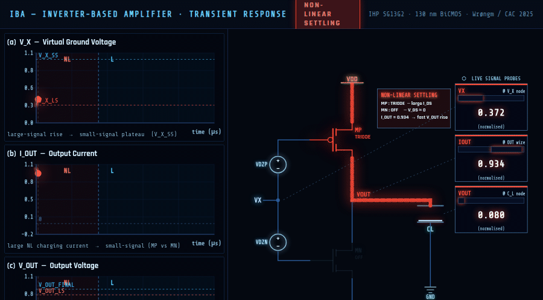

*Figure 4: Animation of the transient response of the Inverter-Based Amplifier (IBA) with step input $V_X$ and deadzone voltages $V_{DZP}$ (0.4 V) and $V_{DZN}$ (0.4 V). $V_{out}$ and $I_{out}$ are shown during the linear and nonlinear settling phases of the dynamic amplifier (behavioral model).*

This two-phase behavior means the output **reaches closer to its final value in the first phase, then settles precisely in the second**, achieving both speed and accuracy that a **pure OTA cannot provide at the same power budget**.


---
  ## 2.2 Error Behavior of Dynamic Amplifiers
---

The dynamic behavior of amplifiers can be better understood by analyzing the **dynamic settling error over time**.


The dynamic error is defined as:

$$
\epsilon_{\text{dynamic}} = \frac{V_{out}(t) - V_{out,\text{final}}}{V_{out,\text{final}}}
$$

and is given by:

$$
\epsilon_{\text{dynamic}} = e^{-t/\tau}
$$

We can see the clear difference in settling behaviour with Log scale plot of Dynamic error. Traditional OTAs exhibit a **single-pole dynamic error response**, resulting in a uniform exponential decay as the system settles toward its final value.

In contrast, **dynamic amplifiers** demonstrate a **two-phase error decay** due to their hybrid **large-signal(fast)** and **small-signal(slow)** operation:

* **Fast decay** dominated by non-linear, large-signal dynamics that rapidly drive the output toward the final value.
* **Slow decay** governed by linear, small-signal settling that settles the output to final value.

<br>

<div align="center">


**Figure 5a :** Modelled dynamic settling error of a Dynamic and linear amplifier, illustrative simulation using analytical two-phase and single-pole models respectively.

</div>

The dynamic amplifier exhibits a two-phase settling behavior. In the initial non-linear (large-signal) phase, the dynamic error decays rapidly, enabling fast convergence toward the target output. This is followed by a linear (small-signal) phase, where the remaining error is reduced more gradually, ensuring accurate final settling.

As shown in **Fig. 5a**, the dynamic amplifier achieves significantly faster settling (≈ 2.113 µs) compared to a purely linear settling amplifier such as an OTA (≈ 3.445 µs) under the same power budget. This improvement arises from the multi-phase nature of dynamic operation: the large-signal phase accelerates the bulk of the transition, while the small-signal phase refines the output to its final value.

Overall, this hybrid settling mechanism allows dynamic amplifiers to combine speed and precision more effectively than traditional linear OTAs.


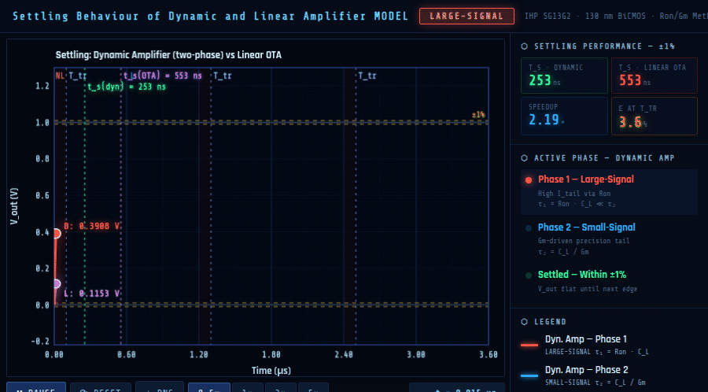

<div align="center">

  **Figure 5b:** Modelled Settling Behaviour of Dynamic and Linear Amplifier

</div>

Dynamic amplifier architectures that exploit this principle include:

* **Inverter-Based Amplifiers (IBAs)** - the simplest form, a CMOS inverter with capacitive feedback **[1]**.
* **Ring Amplifiers (RAMPs)** - a cascaded ring of inverter-like stages with controlled deadzone bias voltages $V_{GP}$, $V_{GN}$ to set the small-signal settling window **[2]**.
* **Zero-Crossing Detector Amplifiers (ZCDs)** - detect the moment the output crosses a threshold and switch off the driving current at that instant **[3]**.

<div align="center">


**Figure 6:** (i) Inverter-Based Amplifier **[8]**, (ii) Ring Amplifier **[1]**, and (iii) Zero-Crossing Detector Amplifier **[3]**.

</div>

---

### The Ring Amplifiers

---

Among dynamic amplifier architectures, the **Ring Amplifier (RAMP)** introduced by Hershberg et al. **[1]** is one of the most widely adopted dynamic amplifier topologies. A RAMP consists of a cascade of 3 inverter-like stages, where the first two stages drive the gates ($V_{GP}$ and $V_{GN}$) of the output-stage transistors. The bias voltages $V_{DZP}$ and $V_{DZN}$ applied to the output stage define the **dead-zone**: the input-referred window around which the net output current charging the load capacitor is zero. Within this window, both the PMOS and NMOS of the output stage carry a quiescent current $I_Q$, establishing a high output impedance and placing the dominant pole at the output of the RAMP. This dead-zone is the key mechanism that governs both **stability** and **settling accuracy**.

As described in Praveen Kumar et al. **[2]**, the overall transient response of a Ring Amplifier is divided into **three distinct dynamic settling phases**:

* **Initial RC settling** - for a large-signal step input, the output of the second stage ($V_{GP}$) is driven close to rail-to-rail. This places a large overdrive on the output-stage PMOS, whose gate-source voltage remains approximately fixed while the drain-source voltage changes. The output current during this phase is governed by the $R_{ON}$ of the output-stage PMOS, charging the load capacitance with an impulse-like current.

* **Large-signal settling** - as feedback from the output reaches back to $V_{GP}$, the gate-source voltage begins to change while the drain-source voltage has nearly settled. The output current during this phase is a function of the large-signal $G_m$ of the ring amplifier, determined by the combined gain of the first two stages and the non-linear $G_m$ of the output stage.

* **Small-signal settling** - as $V_{out}$ approaches its final settling value, $V_x$ settles to the optimal bias point where PMOS and NMOS currents balance. The net output current driving the load capacitor goes to zero and the circuit enters small-signal operation, with a quiescent current $I_Q$ flowing through both output-stage devices. The settling during this phase is governed by the small-signal $g_m$.

For the same average current consumption as a conventional OTA, the initial RC settling and intermediate large-signal settling phases together boost the speed of the Ring Amplifier significantly. Equivalently, for the same settling time as an OTA, these two phases reduce the average current consumption of the RAMP, directly improving the power-speed trade-off.

---

### Prior Work: Optimizer-Based Design of Dynamic/Ring Amplifiers

---

Despite the advantages of dynamic amplifiers, their design has historically demanded time-consuming iterative transient simulations, since conventional AC-based design criteria have limited applicability given the large-signal nature of dynamic amplifier operation. Conrad et al. **[4]** address this challenge by introducing an **optimizer-driven design methodology** for Ring Amplifiers, structured around two test conditions and a cost function that together automate transistor sizing.

The methodology proceeds as follows. A **unit inverter** is first designed shared across stages $A_1$, $A_2$, and $A_3$ with $L_{NMOS} = L_{min}$ for $A_1$ and $A_2$, and a longer $L$ for $A_3$ to ensure large output impedance. The NMOS width is initialized to a manually chosen reasonable value, $V_{DD}$ is fixed manually, and a target $V_{cm}$ is set. This unit inverter is then replicated with multipliers to scale the stages.

Two test conditions drive the optimization loop:

* **Test (A):** $V_{in}$ and $V_{out}$ are both shorted and forced to the trip point and held fixed. The small-signal parameters of the ring amplifier are extracted and checked against user-specified targets (gain, bandwidth, phase margin).
* **Test (B):** Only $V_{in} = V_{cm}$ is applied. The optimizer checks whether $V_{out} = V_{cm}$, confirming that the amplifier is biased at the desired common-mode operating point.

<div align="center">
  
</div>

<em>Fig. 7: Test conditions used in the Conrad et al. optimizer-based Ring Amplifier design methodology [4]. (A) Both</em> $V_{in}$ <em>and</em> $V_{out}$ <em>shorted to trip point for small-signal parameter extraction. (B) Only</em> $V_{in} = V_{cm}$ <em>applied to verify common-mode output. (C) Maximum slew current evaluation to account for</em> $I_{max,P} \neq I_{max,N}$ <em>asymmetry.</em>

The cost function sweeps $V_{cm}$, $V_{DZP}$, $V_{DZN}$ (with $V_{DZP} = V_{DZN}$), and the widths of the PMOS ($M_P$) and NMOS ($M_N$), checking whether the resulting sizes are close to an integer multiplier of the unit cell and whether the small-signal parameters at Test (A) match the user specifications. The candidate sizes are then applied to Test (B): if $V_{out} = V_{cm}$ is satisfied, the sizes are accepted; otherwise the optimizer iterates. A third condition **(C)** additionally evaluates the maximum slew current of the PMOS and NMOS output devices and accounts for the asymmetry when $I_{max,P} \neq I_{max,N}$.

The key limitation of this approach is that the entire methodology is fundamentally iterative cycling through three test conditions, sweeping parameters, and parsing simulation data without any direct connection to the underlying three dynamic settling phases. The optimizer treats the ring amplifier as a black box: it checks whether small-signal parameters pass a cost function, but provides no pre-simulation insight into $R_{ON}$, the RC settling phase, the large-signal $G_m$ phase, or how these behave across process corners. Critically, even after the optimizer converges on a solution, the designer must still run and iterate on full transient simulations to verify actual settling performance, the same manual iterative loop that existed before, just with an automated parameter sweep layer on top. The root problem remains unsolved: there is no quantitative, first-principles handle that connects transistor sizing decisions directly to dynamic settling behavior before simulation.

**Our work addresses this gap.** Rather than relying on an iterative simulation-based optimizer that is dependent on an empirical starting point, we propose a **pre-simulation design methodology** using the **$R_{on}/g_m$** parameter. This approach gives the designer quantitative insight into both the RC settling phase (governed by $R_{on}$) and the small-signal settling phase (governed by $g_m$), **enabling corner-aware transistor sizing directly from lookup tables *without any iterative SPICE runs***. The $R_{on}/g_m$ curves provides a starting point that [4] had to approximate, and in doing so rendering the optimizer loop itself unnecessary for the sizing step.

---


## 2.3 $R_{on}/g_m$ Based Design Methodology

---

In Dynamic amplifiers, the settling behavior is influenced by both **non-linear** and **linear** settling phases. Each of these contributes significantly to the overall settling performance of the Dynamic amplifier and must be accounted for during the design process as well.

---

### Non-Linear Settling Phase

During the initial transient, an impulse current drives $V_{out}$ rapidly toward its Final Voltage ($V_{out,final}$) by charging the load capacitor through the transistor's on-resistance $R_{on}$. This is modeled as **RC-type settling**, where R is signal-dependent.

- The current during this phase is dictated by the **on-resistance** ($R_{on}$) of the transistor. The $R_{on}$ is Non-Linear in nature due to its signal dependance.
- This phase is critical for fast initial movement of $V_{out}$ toward the final output voltage.

### Linear (Small-Signal) Settling Phase

- Once the output is near its final value, **$G_m C$-type small signal settling** takes over. Transconductance $G_m$ determines the fine settling accuracy and closed-loop bandwidth.

- This determines final settling residue and bandwidth
- This is well-captured by classical $g_m/I_D$ methodology

---

### Design Motivation

The classic **$g_m/I_D$ based methodology** is powerful, but it comes with limitations:
- It does **not account for the signal swing requirements**, which results in incorrect operating point assumptions.
- It does **not provide direct information about DC bias ranges**.
- It’s primarily tuned for small-signal operation and overlooks large-signal contributions during design.
- The Variation of $R_{on}$ across corner isn't captured by the $g_m/I_D$ methodology which can silently degrade Slow-corner settling.

> **Key insight:** A circuit with well-sized $g_m$ can still exhibit slow settling if $R_{on}$ is not explicitly constrained, this failure is invisible in a $g_m/I_D$ based flow.

To overcome this, we propose using the **$R_{on}/g_m$** ratio as a design-driven metric.

- The proposed **$R_{on}/g_m$** based methodology should provide information about the required input voltage step.
- The proposed **$R_{on}/g_m$** should provide additional information about Non-linear settling and DC bias(Deadzone ranges).

---
### The $R_{on}/g_m$ Metric

The ratio $R_{on}/g_m$ simultaneously captures:

- **Large-signal settling speed** via $R_{on}$
- **Small-signal bandwidth** via $g_m$

This enables early, pre-simulation verification of settling behavior across process corners.

---

### $R_{on}/g_m$ Based Design Flow

#### **Step 1**: Size the Unit Cell

  - Make a **unit cell** that is independent of C<sub>load</sub> design, but based on **voltage swing requirements**, **Large-signal speed**, **Small-signal requirement** and **Current Consumption**.

#### **Step 2**: Pick $R_{on}$ First

- Decide what **fraction of total settling time** $T_{settle}$ is allocated to the **non-linear (large-signal)** phase vs. the **small-signal (linear)** phase. This split is the key design knob. Here $\alpha$ denotes the fraction reserved for the small-signal phase, so $(1-\alpha)$ is the non-linear budget.

- The empirical time constants are:
  - Non-linear phase: $\tau_{LS} = R_{on} C_{load}$ → set by the switch resistance
  - Small-signal phase: $\tau_{SS} = C_{load}/g_m$ → set by the transconductance

- **Size $R_{on}$** from the non-linear settling budget:

$$R_{on} = \frac{(1-\alpha) \cdot T_{settle}}{5 \cdot C_{load}}$$

  where $(1-\alpha)$ is the time fraction allocated to non-linear settling (factor of 5 for ~99% settling in that phase). The required $R_{on}$ for a given $C_{load}$ then determines the **width scaling multiplier $M$**.

- **Size $g_m$** to satisfy **both** constraints - take the larger of the two:
  - From small-signal BW spec (application requirement): $g_{m,BW} = 2\pi\,f_{BW}\,C_{load}$
  - From settling budget (hyper-optimized lower bound): $g_{m,min} = \dfrac{5\,C_{load}}{\alpha \cdot T_{settle}}$

$$g_m = \max\,(g_{m,min},\; g_{m,BW})$$

  Designing only for $\alpha \cdot T_{settle}$ gives the minimum $g_m$ that just completes settling (hyper-optimized), but most applications impose a small-signal BW requirement that demands a larger $g_m$. The final $g_m$ is set by whichever constraint is tighter.

  > *Example*: $T_{settle} = 1\,\mu\text{s}$, $\alpha = 0.5$, $C_{load} = 1\,\text{pF}$, $f_{BW} = 10\,\text{MHz}$.
  > $R_{on} = \frac{0.5\,\mu\text{s}}{5 \times 1\,\text{pF}} = 100\,\text{k}\Omega$.
  > $g_{m,min} = \frac{5 \times 1\,\text{pF}}{0.5\,\mu\text{s}} = 10\,\mu\text{S}$, $\quad g_{m,BW} = 2\pi \times 10\,\text{MHz} \times 1\,\text{pF} \approx 63\,\mu\text{S}$ → use $63\,\mu\text{S}$.
  
#### **Step 3**: Scale the Unit Cell by $M$


<div align="center">


</div>


- Scaling the unit cell by multiplier (M) gives:
  - $R_{on} \rightarrow R_{unit}/M$
  - $g_m \rightarrow g_{m,unit} \times M$
  - $I_D \rightarrow I_{D,unit} \times M$

#### **Step 4**: Tune $g_m$ via the Replica Path if needed

- The *replica path* which is used to Bias the signal path devices uses:
  - $R_{unit}$, $I_{unit}$, $W_{unit}$
  - Provides *replica tuning flexibility* through $I_{unit}$
  - $g_m$ tuning can be achieved by adjusting $I_{unit}$ and $W_{unit}$ across corners, without changing the main signal path device width $W \times M$

This decouples $g_m$ tuning from the fixed $R_{on}$ constraint, preserving large-signal settling while correcting small-signal bandwidth.

---

### Key Insights

- **$R_{on}$ is a great design knob**, rather than a post-simulation tuning.
- With fixed $g_m/I_D$, $R_{on}$ can be significantly worse in the slow corner affecting large-signal settling even when $g_m$ is nominally correct.
- The same $g_m$ can be achieved across corners in subthreshold with fixed $I_D$, but $R_{on}$ will diverge, this is only visible with the $R_{on}/g_m$ metric.
- The replica path provides a tuning handle for $g_m$ that is orthogonal to the main path sizing, enabling corner-robust design without re-sizing the signal transistors.
- The $R_{on}/g_m$ flow enables **pre-simulation corner verification**, a capability absent from the classical $g_m/I_D$ methodology.
---

# 3. Simulation Environment Setup

---

## 3.1 Automated SPICE Netlist Generation
---
This section demonstrates *automated generation of multiple SPICE netlists*
to explore design variations across **device lengths (L)** and **process corners (TT, SS, FF)**.

---

### Objective
In many simulations, we often need to simulate the same circuit under:
- Different **channel lengths (L)**, and
- Different **process corners** (TT, SS, FF).

Doing this manually in Ngspice is time-consuming and error-prone.  
This Python script automates:
1. Updating transistor length parameters.
2. Substituting the appropriate process corner libraries.
3. Changing the output file name for each sweep case.
4. Saving each unique `.spice` netlist into a folder.

---

### Key Concept
Instead of editing 15 netlists manually, we:
- Keep **one base netlist template**.
- Replace certain parameters programmatically.
- Generate 15 variations (5 lengths × 3 corners).

Each output netlist can be run individually in Ngspice, producing
a `.csv` output containing the sweep data.

---

## `.control` Block Explanation and Local Simulation Guide

Here we explain the SPICE `.control` block and the guide for local simulation.

-----

### The `.control` Block in a SPICE Netlist

The **`.control`** section in a SPICE netlist, often used in simulators like **Ngspice**, defines the **sequence of commands and simulation steps** that the program will execute. Essentially, it's the simulation's scripting environment.

The Base `.spice` Netlist looks like this:

```
** sch_path: /foss/designs/cac/stg3/new_plots/CAC_ONRES_PAPER_Ibias_try1.sch
**.subckt CAC_ONRES_PAPER_Ibias_try1
V2 VG GND 1.65
XMN_B Vbias Vbias GND GND sg13_lv_nmos w={wx} l={lx} ng=1 m=1
I0 VDD Vbias 1u
V1 VDD GND 1.65
V6 VD GND {vdsx}
XMN_RON_B VD VG GND GND sg13_lv_nmos w={wx} l={lx} ng=1 m=1
V7 net1 GND {vout}
XMN_GM_B net1 Vbias GND GND sg13_lv_nmos w={wx} l={lx} ng=1 m=1

**** begin user architecture code

.lib cornerMOSlv.lib mos_tt
.lib cornerMOShv.lib mos_tt
.lib cornerHBT.lib hbt_typ
.lib cornerRES.lib res_typ
.lib cornerCAP.lib cap_typ

.param wx=1u lx=0.50u mx=1 vdsx=50m vout=0.825
.options savecurrents

.control
  unset appendwrite
  set wr_singlescale
  set wr_vecnames

  let start_w = 1u
  let start_vdsx = 0.4125

  foreach w_val 1u 2u 3u 4u 5u 6u 7u 8u 9u 10u
      foreach vds_val 1.65 1.6 1.2375 0.825 0.4125 0.05
         print 'Simulating with W=' $w_val ' 'VDS=' $vds_val

         alterparam wx = $w_val
         alterparam vdsx = $vds_val

         reset
         save all

         dc I0 5u 30u 5u V2 0.4125 1.65 0.4125

         let Ron_unit = @n.xmn_ron_b.nsg13_lv_nmos[vds]/@n.xmn_ron_b.nsg13_lv_nmos[ids]
         let Ipeak_unit = @n.xmn_ron_b.nsg13_lv_nmos[ids]
         let gmron_unit = @n.xmn_ron_b.nsg13_lv_nmos[gm]
         let Ibias_unit = @n.xmn_gm_b.nsg13_lv_nmos[ids]
         let gmbias_unit = @n.xmn_gm_b.nsg13_lv_nmos[gm]
         let gmrp = @n.xmn_b.nsg13_lv_nmos[gm]
         let width = @n.xmn_ron_b.nsg13_lv_nmos[w]
         let length = @n.xmn_ron_b.nsg13_lv_nmos[l]
         let Ron_Gm_unit = Ron_unit/gmbias_unit

         if (($w_val eq start_w) & ($vds_val eq start_vdsx))
           wrdata /foss/designs/cac/stg3/new_plots/LV_NMOS/paper_plots/large_plots/CAC_ONRES_PAPER_LV_NMOS_L_0_50_Ibias_tt.csv v(VG) v(VD) v(Vbias) gmrp Ipeak_unit gmron_unit Ibias_unit gmbias_unit Ron_Gm_unit width length
         else
           set appendwrite
           wrdata /foss/designs/cac/stg3/new_plots/LV_NMOS/paper_plots/large_plots/CAC_ONRES_PAPER_LV_NMOS_L_0_50_Ibias_tt.csv v(VG) v(VD) v(Vbias) gmrp Ipeak_unit gmron_unit Ibias_unit gmbias_unit Ron_Gm_unit width length
         end
      end
  end

  print 'Multi-parameter sweep finished.'
.endc

.GLOBAL VDD
.GLOBAL GND
.end
```

| Section | Command/Code Snippet | Purpose |
| :--- | :--- | :--- |
| **1. Initialization** | `unset appendwrite` | Ensures the data file is *overwritten* initially, not appended to. |
| | `set wr_singlescale` | Writes only the scale for vectors (like the DC sweep variable) once per file. |
| | `set wr_vecnames` | Writes the vector names (e.g., `v(VG)`, `Ron_unit`) as a header line. |
| **2. Loop Over Parameters** | `foreach w_val 1u 2u ... 10u` | Starts the outer loop, iterating the variable **`w_val`** (transistor width, $W$). |
| | `foreach vds_val 1.65 1.6 ... 0.05` | Starts the inner loop, iterating the variable **`vds_val`** (drain-source voltage, $V_{DS}$). |
| **3. Parameter Updates** | `alterparam wx = $w_val` | **Dynamically updates** the circuit parameter `wx` with the current width value from the loop. |
| | `alterparam vdsx = $vds_val` | **Dynamically updates** the circuit parameter `vdsx` with the current $V_{DS}$ value. |
| **4. Run DC Simulation** | `dc I0 5u 30u 5u V2 0.4125 1.65 0.4125` | Executes a **nested DC sweep**. The first sweep is on parameter `I0`(Drain/Source Current) from $5\mu A$ to $30\mu A$ with a step of $5\mu A$ . The second, inner sweep is on voltage source `V2` (the gate voltage, $V_G$) from $0.4125 V$ to $1.65 V$ with a step of $0.4125 V$. |
| **5. Compute Key Quantities** | `let Ron_unit = @n.xmn_...[vds]/@n.xmn_...[ids]` | Uses the **`let`** command to calculate **derived parameters** like the transistor's on-resistance ($R_{on}$), which is defined as $V_{DS}/I_{DS}$. |
| | `let gmron_unit = @n.xmn_...[gm]` | Calculates the transconductance ($g_m$). |
| **6. Export Results** | `wrdata path/to/output.csv ...` | **Writes** the calculated and measured quantities (voltages, currents, $R_{on}$, $g_m$, etc.) to a `.csv` file. |
| **7. Post-Export** | `set appendwrite` | **Crucially**, after the first write, this command ensures that all **subsequent sweeps** (from the loops) will **append** data to the same `.csv` file, building the full dataset without overwriting. |

-----


### `.control` Block - Visual Flow Diagram
---

The table above describes each command; this diagram shows how they connect sequentially:

<table align="center">
  <tr>
    <td align="center">
      
      <br>
      <h4 style="margin:4px 0; font-weight:normal;">
        <em>Fig. 8: .control block execution flow for the CAC on-resistance sweep</em>
      </h4>
    </td>
  </tr>
</table>

> **Each (L, corner) combination produces one CSV file** 15 files total (5 lengths × 3 corners).  
> Each file contains 13 W × 6 VDS × 24 (Ibias × VG) = **1872 data rows**.


---
## Simulation for Look up Table and Plots Generation
---

### This cell does the following

| Step | Task | Est. Time |
|------|------|-----------|
| 1 | Build **Ngspice 45.2** from source with `--enable-osdi` | ~9 min |
| 2 | Download all **IHP SG13G2 model files** (29 `.lib` files) from GitHub | ~30 s |
| 3 | Compile **PSP 103.6 NQS Verilog-A** → `psp103_nqs.osdi` via OpenVAF | ~2 min |
| 4 | Write **`.spiceinit`** so ngspice auto-loads the OSDI on every run | instant |
| 5 | Set simulation **parameters** (lengths, corners, output paths) | instant |
| 6 | Generate netlists and **run all 15 simulations** → CSV output | ~1 min |

> **IHP130 has Verilog-A models and we need to build ngspice from source**  
> The `apt` version on Colab is v36, too old for OSDI. The IHP `sg13_lv_nmos`
> uses the PSP 103.6 NQS compact model (`pspnqs103va`), which must be compiled
> from Verilog-A into a shared `.osdi` library. Both steps require ngspice 45.2
> built with `--enable-osdi`.

---
## 3.2 Build Ngspice 45.2 from Source

The `apt` ngspice on Colab is **v36** and predates OSDI entirely.
We download the 45.2 source tarball from SourceForge and compile with three critical flags:

- `--enable-osdi` - **the key flag**: enables runtime loading of `.osdi` shared libraries
- `--enable-predictor` - required companion flag for `--enable-osdi`
- `--enable-xspice` - extra SPICE elements used by IHP models

 **This step takes ~9 minutes.** Build output is sent to log files to keep output clean.

## 3.3 Download IHP SG13G2 Model Files

All `.lib` files are fetched from `chennakeshavadasa/gmid_IHP130` the same
repo used in the original working attempt. Files land in `/content/models/` so
all relative cross-includes inside the corner files resolve correctly.

---
## 3.4 Compile PSP 103.6 NQS Model → `psp103_nqs.osdi`

`sg13_lv_nmos` uses the **PSP 103.6 NQS** compact model (`pspnqs103va`).
ngspice does not have this built-in, it must be compiled from Verilog-A
source into a shared OSDI library and loaded at runtime.

This step does three things:

**A.** Download **OpenVAF** - the Verilog-A → OSDI compiler  
*(binary from `fides.fe.uni-lj.si`, OSDI 0.3 build - the DigitalOcean CDN is dead)*

**B.** Download **PSP 103.6 NQS Verilog-A source** (`psp103_nqs.va` + all includes)  
*from `dwarning/VA-Models` via GitHub API (bypasses git LFS)*

**C.** Compile `psp103_nqs.va` → `psp103_nqs.osdi` using OpenVAF

> **Note on patchelf:** On some Colab instances the OpenVAF binary needs its ELF
> interpreter patched to use conda's newer glibc. This is handled automatically.
> If conda's glibc isn't found the binary is tried as-is, it works either way.

---
## 3.5 Write `.spiceinit` and Verify Readiness

`.spiceinit` is ngspice's startup config file - read automatically every time
ngspice launches. We write it to both `/content/` and `/root/` so it is found
regardless of working directory.

The critical line is:
```
osdi /content/psp103_nqs.osdi
```
This tells ngspice to load the PSP 103.6 NQS shared library **before parsing
any netlist**. Without it, `sg13_lv_nmos` is an unknown model type and every
simulation fails immediately.

A readiness check runs at the end of this cell all four items should show ✅
before proceeding to simulations.

---
## 3.6 Simulation Configuration

Define sweep parameters and verify all required files exist before launching.

- **5 channel lengths:** 0.2, 0.5, 1, 4, 10 µm
- **3 process corners:** `tt` (typical-typical), `ss` (slow-slow), `ff` (fast-fast)
- **15 total simulations** - each sweeps width (1-10 µm) and V_DS (6 values)
  over a DC bias current sweep (5-30 µA in 5 µA steps)

---
## 3.7 Generate Netlists and Run All 15 Simulations

For each (length, corner) combination, a SPICE netlist is generated from
the verified local template and run with ngspice in batch mode.

**Key design decisions in the netlist:**
- **No `pre_osdi`** in the netlist - OSDI is loaded via `.spiceinit` only
  (`pre_osdi` is interactive-mode only and causes "Error on line 4" in batch mode)
- **Absolute `.lib` paths** (`/content/cornerMOSlv.lib`) - relative paths fail
  because the netlist file lives in `/content/spice_generated/`, not `/content/`
- **`cwd="/content/"`** when invoking ngspice ensures `.spiceinit` is found
  and relative `.include` statements inside the `.lib` files resolve correctly

**Circuit:** Three `sg13_lv_nmos` instances measuring Ron, Gm, and Ron×Gm  
**Sweep:** $W$ = 1-10 µm, $V_{DS}$ = 6 values, $I_{bias}$ = 5-30 µA at each ($W$, $V_{DS}$) point  
**Output:** One CSV per (length, corner) in `/content/simulation_results/`

### Netlist Generation Complete

The cell above generated **15 SPICE netlists** (5 channel lengths x 3 process corners: TT, SS, FF), saved to `/content/spice_generated/`. Each netlist sweeps transistor width (W = 1-10 um) and V_DS across 6 values over a DC bias current range (5-30 uA).

**Connection to the design flow:** These netlists are the simulation inputs that produce the look-up table (LUT) data for the Ron/gm methodology plots in the next section. Without this sweep, there is no data to read off $R_{on}/g_m$ vs $V_{bias}$, $g_m/I_d$, or voltage swing. Each resulting CSV represents one (L, corner) characterisation point in the design space.


### Simulations Complete - CSV Data Extracted

All 15 simulations ran successfully. Each CSV in `/content/simulation_results/` contains the swept $R_{on}$, $g_m$, $V_{bias}$, width, and length data for one (L, corner) combination.


---
# 4. Plot Generation for $R_{on}/g_m$ Methodology Based Design
---

> **Visualization of design plots used in the $R_{on}/g_m$ methodology**

In this section, we generate and analyze the plots required for circuit design using the **$R_{on}/g_m$ methodology**.  
The device characterization data used for these plots was generated during the previous simulation step.

For convenience and reproducibility, we load the **locally extracted simulation data** corresponding to the **LV\_NMOS** and **LV\_PMOS** devices from **IHP 130 PDK**.

These plots provide deeper design insight and enable additional design intuition that is **not readily available in the traditional $g_m/I_D$ methodology**.

Using this framework, we generate **six key design plots**:

1. **$V_{bias}$ vs $R_{on}/g_m$**  
2. **$V_{bias}$ vs Width**  
3. **$I_{peak}$ vs $R_{on}/g_m$**   
4. **$g_{m,bias}$ vs $R_{on}/g_m$**  
5. **$g_m/I_D$ vs $R_{on}/g_m$**  
6. **$V_{swing}$ vs $R_{on}/g_m$**


These plots form the **core design framework of the $R_{on}/g_m$ methodology**, enabling improved trade-off analysis between biasing, device sizing, current consumption, and achievable signal swing.

---

### How to Read These Plots

Each plot is generated by `plot_data()` using data from the simulation CSVs. The table below maps each plot to the design question it answers:

| # | Plot | X-axis | Y-axis | Design Question Answered | How to Use It |
|:--:|:--|:--|:--|:--|:--|
| 1 | **$V_{bias}$ vs $R_{on}/g_m$** | $R_{on}/g_m$ (log) | Gate bias voltage $V_{bias}$ | What bias voltage do I need to hit my target $R_{on}/g_m$? | Read off $V_{DZP}$ / $V_{DZN}$ deadzone voltages directly. Corner spread shows process sensitivity. |
| 2 | **$V_{bias}$ vs Width** | Device width $W$ | Gate bias voltage $V_{bias}$ | What device width corresponds to my chosen bias point? | Use to size the unit cell $W_{unit}$ before applying the multiplier $M$. |
| 3 | **$I_{peak}$ vs $R_{on}/g_m$** | $R_{on}/g_m$ (log) | Peak current $I_{peak}$ (log) | How much peak current does the RC settling phase deliver? | Higher $I_{peak}$ → faster large-signal charging. Sets initial slew rate into $C_{load}$. |
| 4 | **$g_{m,bias}$ vs $R_{on}/g_m$** | $R_{on}/g_m$ (log) | Bias-path $g_{m,bias}$ | What is the bias-path $g_m$? | Verifies small-signal settling bandwidth: $BW = g_{m,bias} / (2\pi C_{load})$. |
| 5 | **$g_m/I_D$ vs $R_{on}/g_m$** | $R_{on}/g_m$ (log) | Efficiency $g_m/I_D$ | What power efficiency am I operating at for this $R_{on}/g_m$ choice? | Bridges the $R_{on}/g_m$ and $g_m/I_D$ methodologies - shows the efficiency cost of a given $R_{on}$ target. |
| 6 | **$V_{swing}$ vs $R_{on}/g_m$** | $R_{on}/g_m$ (log) | Output voltage swing $V_{swing}$ | What output swing is achievable at this operating point? | Confirms the chosen bias allows the required signal swing without clipping. |

**Colour coding:** Each trace is coloured by process corner (TT/SS/FF). The spread between corner traces shows how robust the chosen operating point is across process variation - this is information the $g_m/I_d$ methodology cannot provide pre-simulation.

---


### How to Read the Following 6 Design Plots

Each of the 6 cells below calls `plot_data()`, which:
1. Slices the global `data` DataFrame using `filter_dataframe()` selecting specific VGS, VDS, length, and corner values
2. Groups the result by the specified columns and assigns colours by corner (TT/SS/FF)
3. Generates an interactive Plotly figure with hover tooltips showing all relevant values

**How to use the plots in the design flow:**

- **Hover** over any trace to read exact ($R_{on}/g_m$, $V_{bias}$, width, $g_m/I_d$) values at any point
- **Legend** entries can be clicked to isolate individual corners or lengths
- All X-axes are $R_{on}/g_m$ (log scale), your design target goes on this axis first
- Work left-to-right through the plots: start at Plot 1 to pick $R_{on}/g_m$, then use Plots 2–6 to confirm width, current, and swing requirements


## 4.1 $V_{bias}$ vs log($\frac{R_{on}}{g_m}$)
---

The gate bias voltage $V_{bias}$ of the diode-connected replica transistor varies with device geometry and bias current across all process corners. It is set by the diode connection as $V_{bias} = V_{TH} + V_{ov}$.


The replica is diode-connected in saturation, so its bias voltage is set by $V_{bias} = V_{TH} + V_{ov}$.
In strong inversion ($g_m/I_D \lesssim 15\,\text{V}^{-1}$), the transconductance is approximated as:

$$g_m \approx \frac{2I_D}{V_{ov}} \qquad \text{(strong-inversion approximation)}$$

$$\Rightarrow \quad V_{ov} = \frac{2I_D}{g_m} \qquad \therefore \quad V_{bias} = V_{TH} + \frac{2I_D}{g_m}$$

> **Note on inversion region:** This approximation holds well for $g_m/I_D \lesssim 15\,\text{V}^{-1}$
> (moderate-to-strong inversion, corresponding to **larger $R_{on}/g_m$** values on the right
> side of the plot, where the device operates with meaningful overdrive). At higher
> $g_m/I_D > 20\,\text{V}^{-1}$ (subthreshold, **smaller $R_{on}/g_m$**, left side of plot),
> $g_m \approx I_D/nV_T$ and the formula above underestimates $V_{bias}$. At lower
> $g_m/I_D < 5\,\text{V}^{-1}$ (deep strong inversion, **largest $R_{on}/g_m$**, right
> extreme of plot), the approximation is most accurate. In all cases, $V_{bias}$ is read
> directly from the LUT plot - the formula is for physical intuition only.

Multiplying and dividing by $R_{on}$:

$$\boxed{V_{bias} = V_{TH} + \frac{2I_D}{V_{swing}} \cdot I_{peak} \cdot \frac{R_{on}}{g_m}}$$

where $R_{on} = V_{swing}/I_{peak}$. This shows that **$V_{bias}$ is linear in $R_{on}/g_m$**,
which on a logarithmic x-axis produces the exponential rise visible in the plots. Two design
dependencies are immediately readable:

- **Higher $I_D$** at fixed $R_{on}/g_m$: more current demands more overdrive → $V_{bias}$ rises
- **Larger $R_{on}/g_m$** at fixed $I_D$: directly scales $V_{bias}$ upward along each trace

- **Higher $I_D$** at fixed $R_{on}/g_m$: more current demands more overdrive → $V_{bias}$ rises
- **Larger $R_{on}/g_m$** at fixed $I_D$: directly scales $V_{bias}$ upward along each trace

---

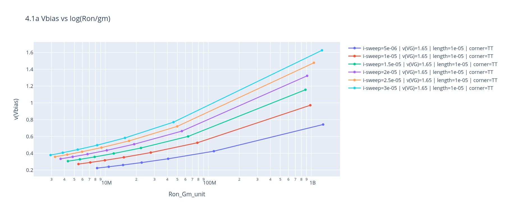

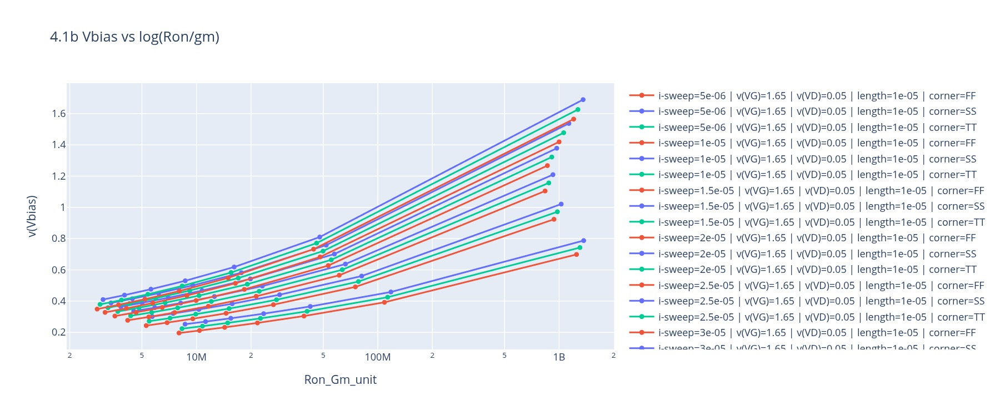

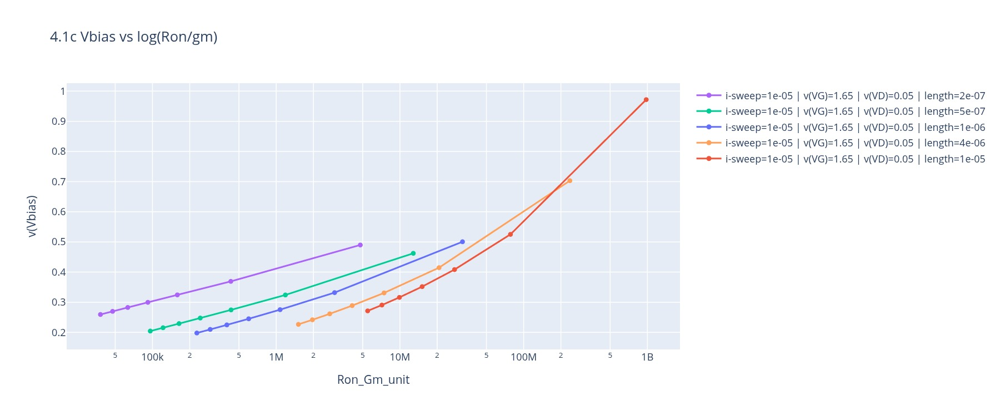

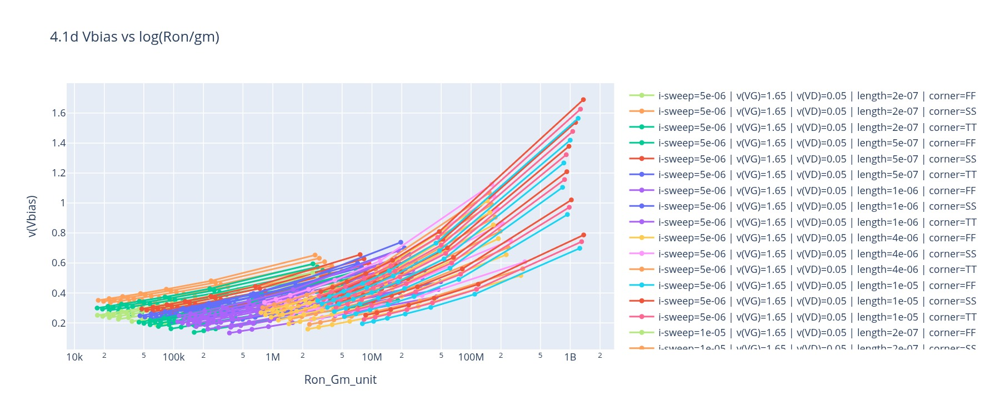

---

### Trends

> **Reading the plot:**
> - **Top → Bottom** at fixed $R_{on}/g_m$: $I_{sweep}$ **decreases**
>   (lower current → lower overdrive required → lower $V_{bias}$)
> - **Left → Right** along a fixed $I_{sweep}$ trace: $L$ **increases**
>   (larger $R_{on}/g_m$ directly raises $V_{bias}$ through the linear relationship above)

As expected, the **SS corner** sits highest at any given $L$ and $I_{sweep}$: a slow-corner device has a larger $V_{TH}$ and lower $\mu C_{ox}$, both of which demand a higher gate voltage to source the same current. The FF corner sits lowest.

---

### Key Insight

$V_{bias}$ is the deadzone voltage, the output-stage transistor does not enter the small-signal settling region until its gate voltage crosses $V_{bias}$. The expression above makes the binding constraint explicit: **the SS corner at the largest $L$ and highest $I_{sweep}$ sets the worst-case $V_{bias}$**, which must be met by the preceding stage's output swing across all corners.

Width and current are coupled through $g_m$: increasing $W$ lowers $V_{bias}$ (through $g_m \uparrow$, so $V_{ov} \downarrow$) but also lowers $R_{on}$, directly affecting the non-linear RC settling speed. Reading this plot together with the $g_{m,\text{bias}}$ vs $R_{on}/g_m$ plot gives the complete picture, the target $R_{on}/g_m$ maps to a specific ($W$, $I_{sweep}$) pair, and the corresponding $V_{bias}$ here is the voltage that must be guaranteed across all corners for the output stage to transition into the small-signal phase.

---

## 4.2 $V_{bias}$ vs $Width$
---

The gate bias voltage $V_{bias}$ of the diode-connected replica transistor varies with device width $W$, across all bias currents $I_{sweep}$, VDS values, and process corners for a given channel length.

The diode-connected replica sets $V_{bias} = V_{TH} + V_{ov}$, where:

$$V_{bias} = V_{TH} + \sqrt{\frac{2I_D}{\mu C_{ox}(W/L)}} \qquad \Rightarrow \qquad V_{bias} - V_{TH} \propto \frac{1}{\sqrt{W}}$$

This $1/\sqrt{W}$ decay is the dominant feature of the plot, the rapid drop at small $W$ (1–5 µm) followed by a flattening at larger widths. Each trace is one combination of ($I_{sweep}$, $V_{DS}$, corner), and all follow the same curve shape, shifted vertically by their bias current.

- **Higher $I_{sweep}$** → trace shifts upward: more current demands higher overdrive to sustain it in the replica device
- **Larger $W$** → $V_{bias}$ decreases: a wider device carries the same current at a lower $V_{GS}$, reducing the required bias voltage
- **Corner spread** → SS corner (higher $V_{TH}$) sits above TT and FF at the same width and current, directly showing which corner demands the highest $V_{bias}$ to enter the small-signal settling region
- **Multiple $V_{DS}$ values overlaid** → the spread between $V_{DS}$ traces is small, confirming that $V_{bias}$ is primarily set by the diode-connected replica (which operates at $V_{DS} = V_{GS}$) and is relatively insensitive to the drain voltage of the main-path device
---

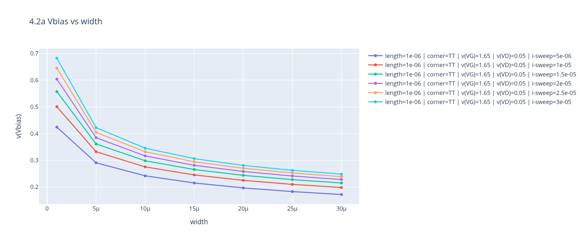

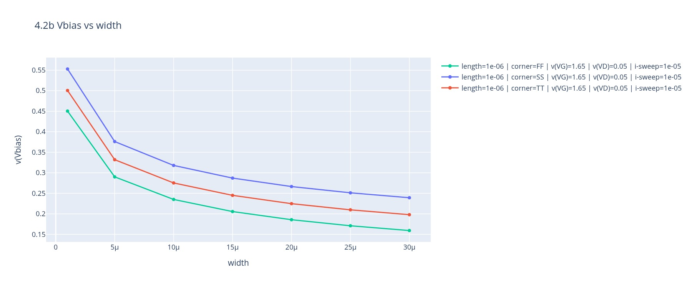

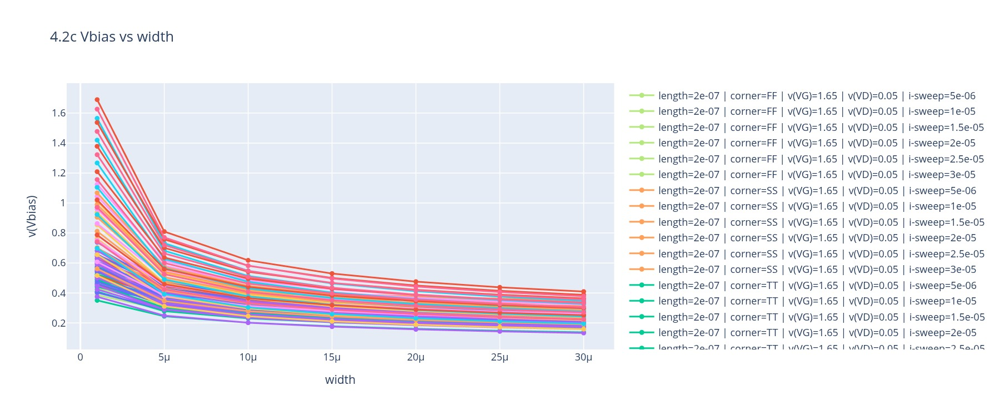

---

### Trends

> **Reading the plot:**
> - **Top → Bottom** at fixed $Width$: $Length$ and $I-sweep$ **decreases**
>   (lower current → lower overdrive required → lower $V_{bias}$)

As expected, the **SS corner** sits highest at any given $L$ and $I_{sweep}$: a slow-corner device has a larger $V_{TH}$ and lower $\mu C_{ox}$, both of which demand a higher gate voltage to source the same current. The FF corner sits lowest.

---

### Key Insight

For a **given $W$ and bias current, what $V_{bias}$ must be applied to the gate of the final-stage transistor to ensure it operates in the small-signal settling region?**

Width and current are coupled through $g_m$: increasing $W$ lowers $V_{bias}$ but also lowers $R_{on}$, which affects the non-linear RC settling speed (Plot 3). Reading Plot 2 together with Plot 1 ($V_{bias}$ vs $R_{on}/g_m$) gives the designer the complete picture: the target $R_{on}/g_m$ from Plot 1 maps to a specific ($W$, $I_{sweep}$) combination here, and the corresponding $V_{bias}$ is the deadzone voltage that must be met across all process corners for the IBA final stage to enter small-signal mode.

---

## 4.3 Log($I_{peak}$) vs Log($\frac{R_{on}}{g_m}$)
---

**$I_{peak}$** is the initial large-signal current that flows through the output-stage transistor at the onset of the settling transient. This current charges the load capacitor $C_L$ during the non-linear RC phase it determines how fast the output moves toward its final value before the small-signal exponential phase takes over.

In the linear (triode) region, the output-stage transistor on-resistance is:
$$R_{on} = \frac{L}{\mu C_{ox} W V_{ov}} \propto \frac{L}{W I_D}$$

Combining these:
$$\boxed{I_{peak} = \frac{V_{swing}}{R_{on}} \propto \frac{1}{R_{on}/g_m}}$$

On a log-log scale this gives:
$$\log(I_{peak}) = -\log\!\left(\frac{R_{on}}{g_m}\right) + \text{const}$$

which is approximately a **straight line with slope $-1$** seen in the plot. The spread between TT/SS/FF traces at each bias current reflects the process-corner sensitivity of $I_{peak}$ - the FF corner (green) consistently delivers higher $I_{peak}$ than SS (red) at the same $R_{on}/g_m$, since a faster process has lower $R_{on}$ and higher carrier mobility, both of which increase the initial charging current. This corner spread grows at larger $R_{on}/g_m$ values (longer $L$ or lower $I_D$), making worst-case SS-corner $I_{peak}$ the binding constraint when sizing for non-linear settling speed.

---

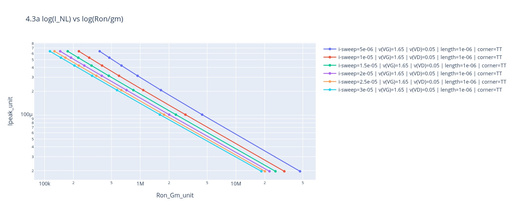

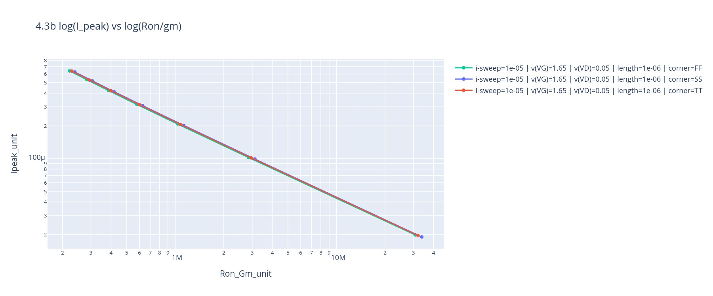

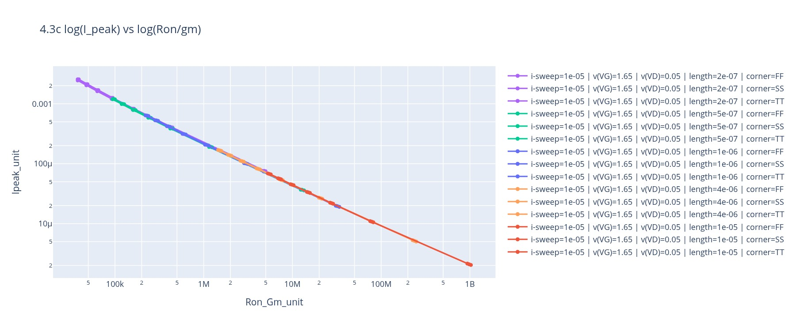

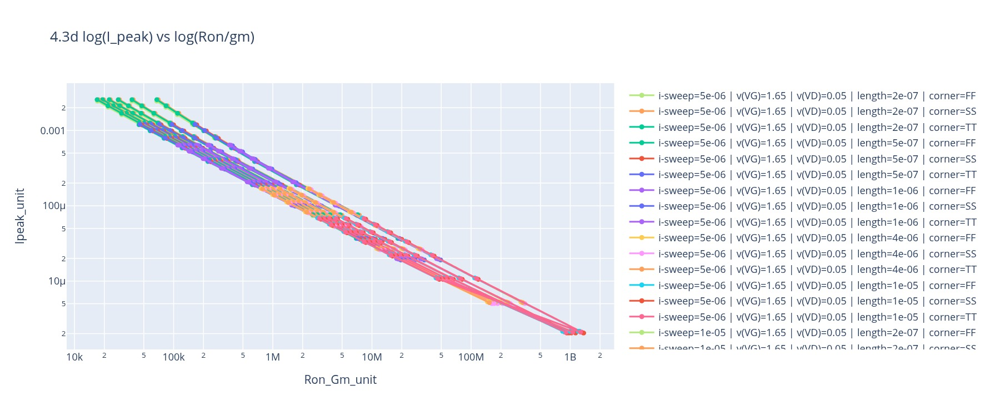

---
### Trends

> **Reading the plot:**
> - **Top → Bottom** at fixed $R_{on}/g_m$: $I_{sweep}$ **decreases**  
>   (lower current → lower $I_{peak}$)
>
> - **Left → Right** along a fixed $I_{sweep}$ trace: $R_{on}/g_m$ **increases**  
>   ($L \uparrow$ or $W \downarrow$ → $R_{on} \uparrow$ → $I_{peak} = V_{swing}/R_{on} \downarrow$ → slower initial charging)

---

- **Moving Right ($R_{on}/g_m \uparrow$):**  
  $R_{on} \uparrow$ → $I_{peak} \downarrow$ → slower non-linear settling  

- **Moving Left ($R_{on}/g_m \downarrow$):**  
  $R_{on} \downarrow$ → $I_{peak} \uparrow$ → faster initial charging  

- **Each trace = fixed $I_{sweep}$:**  
  Higher $I_{sweep}$ shifts curves upward (higher $I_{peak}$)

- **Corners:**  
  **SS** sits lowest (higher $R_{on}$ → lower $I_{peak}$),  
  **FF** sits highest (lower $R_{on}$ → higher $I_{peak}$)
---

### Key Insight

The geometry dependence of $R_{on}/g_m$ is explicit:

$$\frac{R_{on}}{g_m} \propto \frac{L^2}{W I_D}$$

This means $L$ is the dominant geometry knob for the non-linear, but the replica bias path allows $I_D$ to be adjusted independently tuning $g_m$ and small-signal bandwidth without disturbing the main-path $R_{on}$. This is the pre-simulation design handle that the $g_m/I_D$ methodology does not provide.

---

## 4.4 $g_{m,\text{bias}}$ vs Log($R_{on}/g_m$)
---

**$g_{m,\text{bias}}$** is the transconductance of the transistor in the replica bias branch, the same device as the unit output-stage transistor. It sets the small-signal settling bandwidth and appears as the $g_m$ denominator in the $R_{on}/g_m$ design parameter. Because the bias branch mirrors the output transistor, tuning $I_{sweep}$ directly controls $g_{m,\text{bias}}$ without disturbing the main signal path.

These two quantities are evaluated at **different operating points**: $R_{on}$ is extracted with the switch fully on in triode ($V_{GS} = V_{DD}$, $V_{DS} = 50\,\text{mV}$), while $g_{m,\text{bias}}$ is evaluated in saturation at the replica bias current a different overdrive from $V_{GS,\text{sw}} - V_{TH}$:

$$R_{on} = \frac{L}{\mu C_{ox} W (V_{GS,\text{sw}} - V_{TH})}, \qquad g_{m,\text{bias}} = \sqrt{2\mu C_{ox}\frac{W}{L}I_D} = \frac{2I_D}{V_{ov,\text{bias}}}$$

Because $V_{ov,\text{bias}} \neq V_{GS,\text{sw}} - V_{TH}$, the product $R_{on} \cdot g_{m,\text{bias}}$ is **not constant**. Eliminating $L$ at fixed $W$ and $I_D$, using $R_{on} \propto L$, $g_{m,\text{bias}} \propto L^{-1/2}$, so $R_{on}/g_m \propto L^{3/2}$ gives the fundamental scaling:

$$g_{m,\text{bias}} \propto \left(\frac{R_{on}}{g_m}\right)^{-1/3}$$

This is a power law with exponent $-1/3$: on a log-log axis (Plot 4.4b) it appears as a **straight line of slope $-1/3$**, while on the semilog axis (Plot 4.4a) it produces a concave falling curve, the logarithmic x-axis compresses the right side, making the decay appear steeper than the underlying exponent.

- **Higher $I_{sweep}$** → curve shifts upward: more bias current raises $g_{m,\text{bias}} = 2I_D/V_{ov}$ at every $R_{on}/g_m$ value ($g_{m,\text{bias}} \propto \sqrt{I_D}$, so doubling $I_{sweep}$ lifts the curve by $\sqrt{2}$)
- **Left → Right** along a fixed $I_{sweep}$ trace: $L$ increases ($R_{on}/g_m \propto L^{3/2}$ pushes the operating point rightward while $g_{m,\text{bias}} \propto L^{-1/2}$ pulls it downward)
- **Corner spread** → process corners shift $\mu C_{ox}$ and $V_{TH}$, vertically separating the constant $I_D$ curves; the SS corner sits highest at any given $(W, L, I_D)$
---

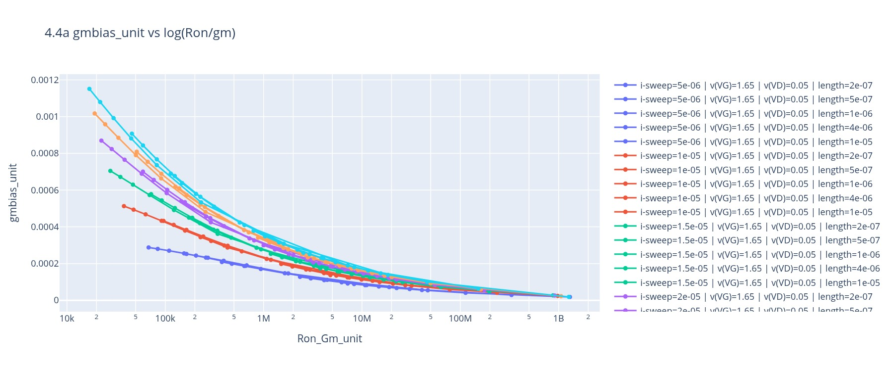

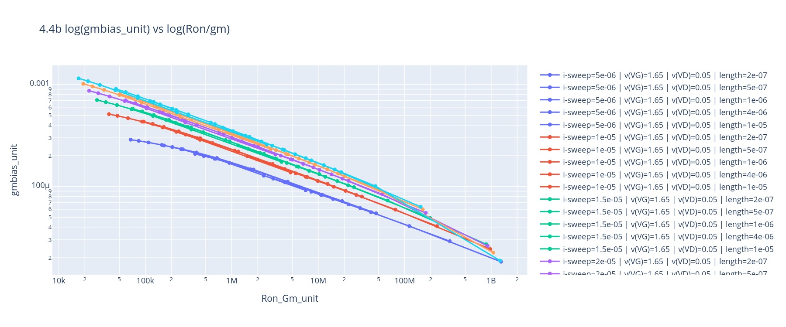

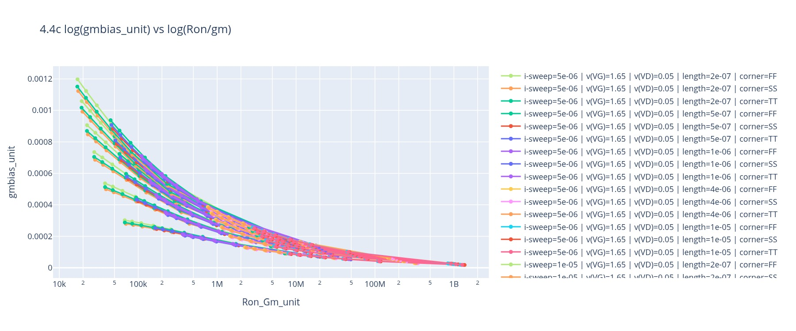

---

### Geometry Universality at Fixed $I_D$

The same $-1/3$ exponent holds whether $W$ or $L$ is varied any $(W, L)$ pair mapping to the same $R_{on}/g_m$ value at the same $I_D$ produces the same $g_{m,\text{bias}}$. The traces for different lengths therefore do not form separate curves; each length accesses a **different segment of the same universal curve**, and all collapse onto a single locus in the $(R_{on}/g_m,\, g_{m,\text{bias}})$ plane.

> **Reading the plot:**
> - **Top → Bottom** at fixed $R_{on}/g_m$: $I_{sweep}$ **decreases**
>   (lower bias current → lower $g_{m,\text{bias}} = 2I_D/V_{ov,\text{bias}}$)
> - **Left → Right** along a fixed $I_{sweep}$ trace: $L$ **increases**
>   ($R_{on}/g_m \propto L^{3/2}$ grows rapidly, extending the trace rightward and downward along the same universal curve)

---

### Key Insight

**Given a target small-signal time constant $\tau_{ss} = C_L / g_{m,\text{bias}}$, what bias current is required without committing to a specific $(W, L)$?**

Because $g_{m,\text{bias}}$ is uniquely determined by $R_{on}/g_m$ and $I_D$ alone, the required $I_{sweep}$ can be read directly from this plot once $\tau_{ss}$ is specified. Width is then chosen independently to meet the $R_{on}/g_m$ target (non-linear phase speed), completing the two-axis co-design that $g_m/I_D$ alone cannot decouple.

---

## 4.5 $g_m/I_D$ vs Log($\frac{R_{on}}{g_m}$)
---

- Here we look at the $g_m/I_D$ of the transistor as a function of the $R_{on}/g_m$ design metric, sweeping bias current $I_{sweep}$ across process corners.

- We can see that $g_m/I_D$ decreases as $R_{on}/g_m$ increases

- $R_{on}/g_m \propto L^2/WI_D$ and $g_m/I_D = 2/V_{ov}$ as $R_{on}/g_m$ increases (wider device, lower $I_D$, or longer $L$), the overdrive $V_{ov}$ increases, pushing the device deeper into strong inversion and reducing transconductance efficiency:

$$\frac{g_m}{I_D} = \frac{2}{V_{ov}} \propto \frac{1}{\sqrt{R_{on}/g_m \cdot I_D}}$$

The negative slope seen in both plots directly confirms this, moving right on the x-axis corresponds to moving from moderate inversion toward strong inversion, where the device is less efficient per unit current.

The bias current is the primary design knob in this plot. Each trace corresponds to a fixed $I_{sweep}$:

- **Higher $I_{sweep}$** → trace shifts **downward** at the same $R_{on}/g_m$,  more current for the same geometry means the device operates deeper into strong inversion, reducing $g_m/I_D$. The $R_{on}/g_m$ operating range of the trace remains the same; only the efficiency drops.
- **Lower $I_{sweep}$** → trace shifts **upward** at the same $R_{on}/g_m$, less current keeps the device closer to moderate inversion, improving $g_m/I_D$ while the RC settling speed (set by geometry) is unchanged.

For a given geometry ($W$, $L$), the designer chooses $I_{sweep}$ to trade between transconductance efficiency and settling speed, this trade-off is directly readable from the plot.

This plot **connects the $R_{on}/g_m$ and $g_m/I_D$ methodologies**, and the relationship is strictly one-directional:

> **From $R_{on}/g_m$ → you can read $g_m/I_D$ directly off this plot.**
> **From $g_m/I_D$ → you cannot recover $R_{on}/g_m$ without additional simulation.**

The reason is fundamental: $g_m/I_D$ characterises only the small-signal operating point. It contains no information about $R_{on}$, which depends separately on $V_{ov}$, $W$, $L$, and the large-signal drain voltage. A designer entering from $g_m/I_D$ can size the device for bandwidth, but has no pre-simulation handle on where that size sits on the $R_{on}/g_m$ axis and therefore no visibility into the non-linear RC settling phase.

Entering from $R_{on}/g_m$ subsumes the $g_m/I_D$ design entirely: once $R_{on}/g_m$ and $I_{sweep}$ are chosen, this plot immediately tells the designer what $g_m/I_D$ and therefore what inversion region and power efficiency corresponds to that operating point. **The $R_{on}/g_m$ methodology is therefore a strict superset of the $g_m/I_D$ methodology for dynamic amplifier design.**

---

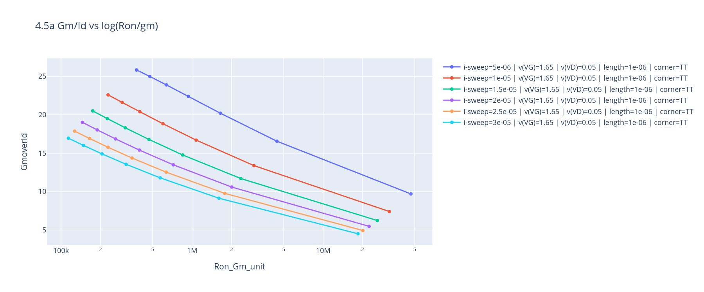

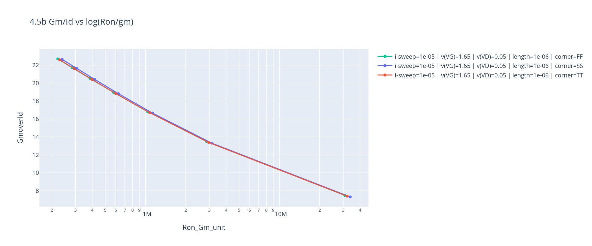

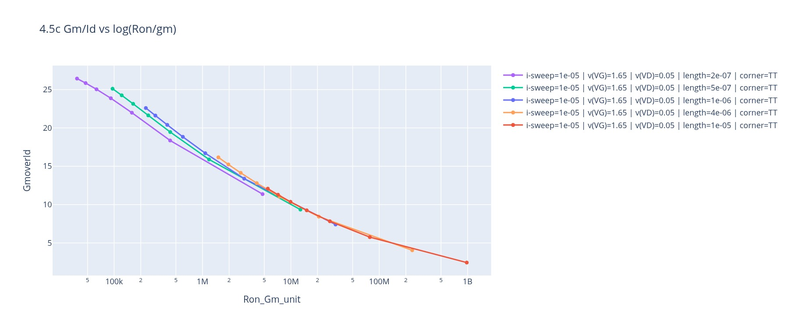

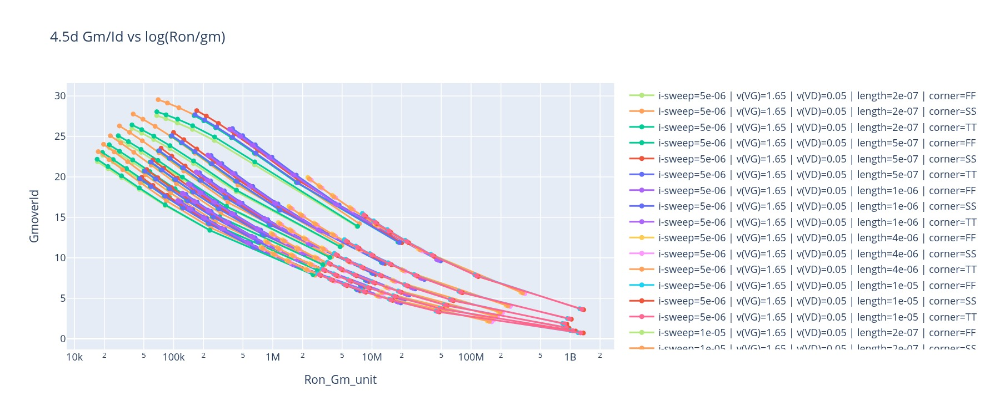

---

### Key Insight

A designer entering from $g_m/I_D$ can size the device for bandwidth, but has no pre-simulation visibility into Non-Linear settling information ($R_{on}$), the deadzone bias voltages, or worst-case corner behaviour all of which require additional SPICE runs to discover. Entering from $R_{on}/g_m$ subsumes this entirely: once $R_{on}/g_m$ and $I_{sweep}$ are fixed, $g_m/I_D$ is directly readable from this plot and both settling phases are co-designed in a single step. The $g_m/I_D$ axis is a projection of the $R_{on}/g_m$ design space onto a single dimension, every $g_m/I_D$ point maps to a unique $R_{on}/g_m$ point, but the reverse does not exist without simulation.

---

## 4.6 $V_{swing}$ vs Log($\frac{R_{on}}{g_m}$)
---

**$V_{swing}$** is defined as:

$$V_{swing} = |v(VG) - v(Vbias)| = v(VG) - v(Vbias) \quad \text{(when } v(VG) > v(Vbias)\text{)}$$

It represents the gate drive headroom beyond the quiescent bias point the voltage the gate must traverse before the output-stage transistor enters the small-signal settling region. During non-linear settling, the dynamic amplifier sees an initial large-signal gate swing close to $V_{DD}$; as the output approaches its final value and the gate voltages of the final-stage devices reach $V_{GP} = V_{bias,P}$ and $V_{GN} = V_{bias,N}$, $V_{swing}$ equals zero, at which point $I_{out} = 0$ and the circuit transitions to small-signal mode.

In the triode region, $R_{on}$ depends on overdrive voltage, which itself depends on how far the gate is driven above the bias point:

$$R_{on} = \frac{L}{\mu C_{ox} W (v(VG) - V_{th})} \qquad \Rightarrow \qquad R_{on} \downarrow \text{ as } v(VG) \uparrow$$

A larger $V_{swing} = v(VG) - v(Vbias)$ means the transistor is driven harder into the triode region resulting in lower $R_{on}$, faster RC settling. This is why the plot shows a **negative slope**: larger $V_{swing}$ corresponds to smaller $R_{on}/g_m$.

$$\boxed{V_{swing} = v(VG) - v(Vbias) \propto \frac{1}{\sqrt{R_{on}/g_m}}}$$

At $v(VG) = V_{DD} = 1.65\,\text{V}$ (the fully-on condition used in earlier design plots), this simplifies to:

$$V_{swing} = V_{DD} - v(Vbias)$$

confirming that the available swing equals the gate rail minus the quiescent bias- a quantity entirely predictable from the LUT without transient simulation.

A common assumption in dynamic amplifier design is that the output-stage transistor always sees a full-rail swing ($V_{swing} \approx V_{DD}$) during the non-linear phase. **This is not always true.**

Consider a designer who targets a small $R_{on}/g_m$ expecting fast non-linear settling. From Plot 4.3, small $R_{on}/g_m$ implies large $I_{peak}$ and fast RC charging. But Plot 4.6 reveals the other side: **a small $R_{on}/g_m$ is only achievable if the input swing is large enough to drive the gate far above $v(Vbias)$**. If the actual input signal never delivers that swing for example, in a low-voltage or small-signal application the transistor never reaches the operating point the designer assumed, and the expected settling speed is not achieved.

Conversely, at large $R_{on}/g_m$ (right side of the plot), $V_{swing}$ is small, the gate barely rises above $v(Vbias)$, the transistor stays near the edge of the linear region, and the non-linear RC phase contributes little to nothing in the overall settling. The small-signal phase dominates.

This plot therefore answers: **for a given $R_{on}/g_m$ target, what input swing must the circuit actually see to operate at that point?**

---

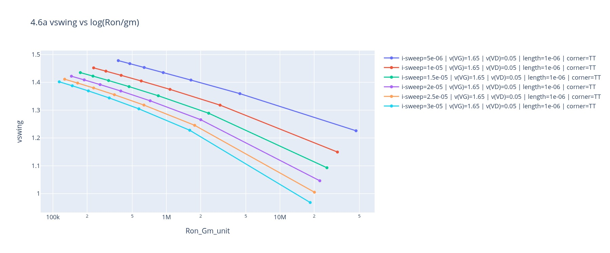

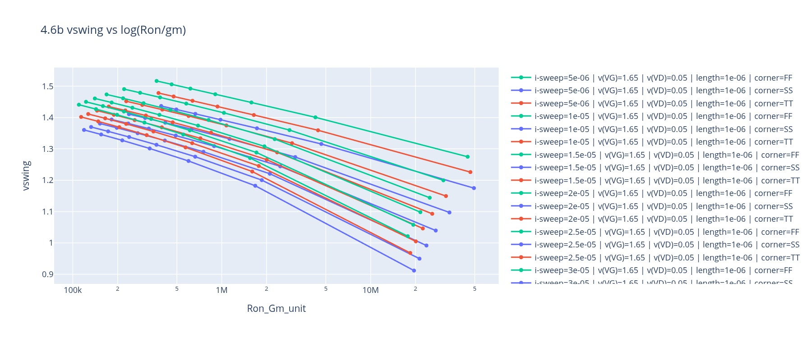

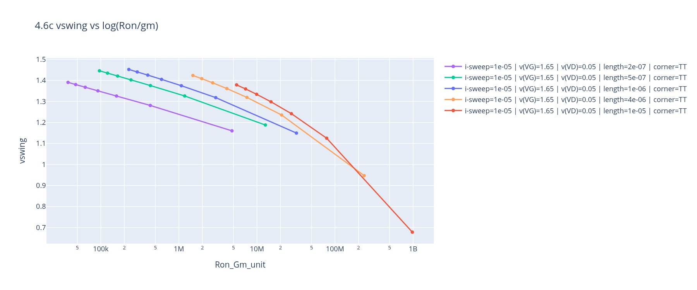

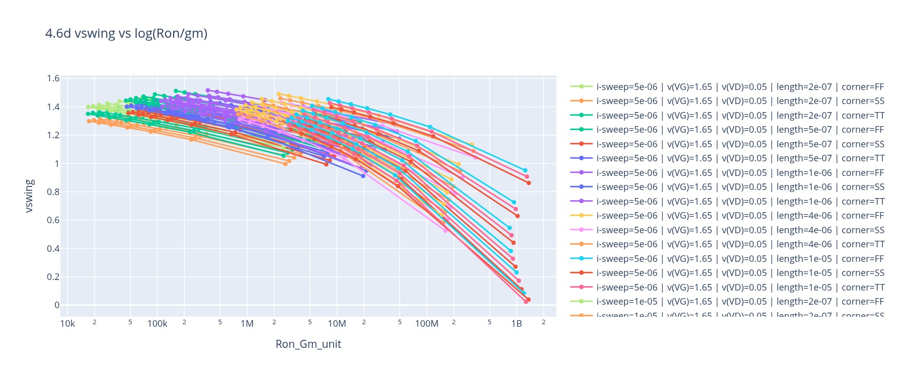

---

### Trends

> **Reading the plot:**
> - **Top → Bottom** at fixed $R_{on}/g_m$: $I_{sweep}$ **increases**  
>   (more bias current → higher $v(Vbias)$ → less headroom → smaller $V_{swing}$)
>
> - **Left → Right** along a fixed $I_{sweep}$ trace: $R_{on}/g_m$ **increases**  
>   ($L \uparrow$ or $W \downarrow$ → $R_{on} \uparrow$ → device driven less hard → $V_{swing} \downarrow$)

---

- **Moving Left ($R_{on}/g_m \downarrow$):**  
  $V_{swing} \uparrow$ - gate is driven hard above $v(Vbias)$, transistor deep in triode, $R_{on}$ low, fast non-linear settling. Only achievable if the input signal delivers sufficient swing.

- **Moving Right ($R_{on}/g_m \uparrow$):**  
  $V_{swing} \downarrow$ - gate barely clears $v(Vbias)$, non-linear phase contributes little, small-signal settling dominates.

- **Higher $I_{sweep}$** raises $v(Vbias)$ (more current needs more gate drive), reducing $V_{swing}$ at the same geometry, traces shift downward.

- **Longer $L$** pushes traces rightward (higher $R_{on}/g_m \propto L^2$) with lower $V_{swing}$ at the same $I_{sweep}$.

- **Corners:** SS corner gives lowest $V_{swing}$ at the same $R_{on}/g_m$ and higher $V_{th}$ raises $v(Vbias)$, eating into the available headroom. This is the worst-case corner for non-linear settling speed, consistent with Plot 4.1.

---

### Key Insight

$V_{swing}$ is not a free parameter; it is set by the application's input signal amplitude and the bias point simultaneously. This plot makes visible a constraint that the $g_m/I_D$ methodology cannot surface: **there is a minimum required input swing to operate at any given $R_{on}/g_m$ target**. A designer who picks a small $R_{on}/g_m$ for fast settling must verify that the circuit actually sees the corresponding $V_{swing}$; otherwise the assumed operating point is never reached and the settling speed budget is violated. Reading Plot 4.6 alongside Plot 4.1 ($V_{bias}$ vs $R_{on}/g_m$) and Plot 4.3 ($I_{peak}$ vs $R_{on}/g_m$) gives the complete pre-simulation picture of the non-linear settling phase.


---

An enhanced and more interactive version of this plotting tool has been developed by the authors and is available online. **Reviewers are strongly encouraged to explore this tool**, as it provides a more intuitive interface for analysis. Users can create custom expressions, modify plots, and interact with the visualizations in a highly flexible manner, offering insights beyond the figures presented in this notebook.  

<div align="center">

**Website:** <a href="https://wrongm.team-seakers.com/" target="_blank"><b>wrongm.team-seakers.com</b></a>

</div>


---
# 5. Design of Inverter-Based Amplifier

---

Let's compare the performance of an inverter-based amplifier (IBA), which is inherently a dynamic amplifier, designed using traditional $g_m/I_D$ and $R_{on}/g_m$ based methodologies and evaluate which methodology provides more useful design insights into dynamic amplifiers and reduces the design iteration count required to reach the final specification.

<div align="center">
  
</div>

*Figure 9: Schematic of the Inverter-Based Amplifier (IBA) in capacitive feedback.*

---

> **Purpose of this section:** This section designs the same IBA using the *conventional $g_m/I_D$ approach* as a **baseline for comparison**. The core limitation of this approach that $g_m/I_D$ gives no information about $R_{on}$ or the non-linear RC settling phase or the bias deadzones for dynamic amplifiers will become clear once we compare the results against the $R_{on}/g_m$ design in the next section.

---

### Specifications / Design Goals

| Parameter | Symbol | Value | Notes |
|---|---|---|---|
| Supply voltage | $V_{DD}$ | 1.65 V | IHP SG13G2 nominal |
| Settling time | $T_{settle}$ | 250 ns | 5$\tau$, 99.3% settled |
| Settling time constant | $\tau_{cl}$ | 50 ns | $T_{settle}/5$ |
| Closed-loop bandwidth | $\omega_{cl}$ | 20 Mrad/s | $1/\tau_{cl}$ |
| Unity-gain bandwidth | UGB | 9.55 MHz (60 Mrad/s) | $\omega_{cl}/\beta$ |
| Target transconductance | $G_m$ | 40 µA/V | $\text{UGB} \times C_{L,eff}$ |
| DC gain | $A_0$ | 50 | $g_m/g_{ds}$ limit, lv\_nmos |
| Sampling capacitor | $C_s$ | 500 fF | |
| Feedback capacitor | $C_f$ | 250 fF | |
| Load capacitor | $C_l$ | 500 fF | |
| Effective load | $C_{L,eff}$ | 667 fF | $C_l + C_f C_s/(C_s+C_f)$ |
| Feedback factor | $\beta$ | 1/3 | $C_f/(C_s+C_f)$ |
| Closed-loop gain (ideal) | $G_{cl}$ | $-2$ V/V | $-C_s/C_f$ |
| Closed-loop gain (actual) | $G_{cl}$ | $-1.887$ V/V | Finite $A_0$ effect |
| Input bias point | $V_{in,dc}$ | 825 mV | $V_{DD}/2$, inverter switching threshold |
| Input swing | $\Delta V_{in}$ | $\pm 200$ mV | $V_{DD}/2 \pm 200$ mV |

**Large-signal condition:** Input kick at virtual ground $\Delta V_x = \pm 133$ mV $> V_{ov,lv\_nmos} \approx 100$ mV, guaranteeing the amplifier enters the slewing (large-signal) regime on every cycle before transitioning to exponential small-signal settling. This is the regime of interest for the $R_{on}/G_m$ methodology.

---


### Design of IBA using Traditional ($g_m/I_D$) Methodology

---

- For a settling time $T_{settle} = 250\,\text{ns}$ (5$\tau$), the required closed-loop bandwidth is:
  $$
  \omega_{cl} = \frac{1}{\tau_{cl}} = \frac{5}{T_{settle}} = 20\,\text{Mrad/s}, \qquad \text{UGB} = \frac{\omega_{cl}}{\beta} = \frac{20\,\text{Mrad/s}}{1/3} = 60\,\text{Mrad/s}
  $$

- The total required transconductance is:
  $$
  G_m = \text{UGB} \times C_{L,eff} = 60 \times 10^6 \times 667 \times 10^{-12} \approx 40\,\mu\text{S}
  $$

- Assume NMOS and PMOS contribute equally:
  $$
  g_{mn} = g_{mp} = \frac{G_m}{2} = 20\,\mu\text{S}
  $$

- With multiplier $m = 4$, the unit cell (replica path) must provide:
  $$
  g_{m,unit} = \frac{20\,\mu\text{S}}{4} = 5\,\mu\text{S}
  $$

- Replica path quiescent current $I_q = 0.5\,\mu\text{A}$, signal path current $= m \times I_q = 2\,\mu\text{A}$. This gives:
  $$
  \frac{g_{m,unit}}{I_q} = \frac{5\,\mu\text{S}}{0.5\,\mu\text{A}} = 10\,\frac{\text{S}}{\text{A}}
  $$

- Target $g_m/I_D = 10\,\text{V}^{-1}$ for both LV_NMOS and LV_PMOS - corresponding to **moderate inversion**, where large-signal and small-signal settling contributions are both significant.

- Assume $g_m/g_{ds} = 50$ (intrinsic gain limit of lv\_nmos in IHP SG13G2)

---

- Using our `gmid_IHP130` model to extract device sizes:
  - Target $g_m/I_D = 10\,\text{V}^{-1}$
  - Target $g_m/g_{ds} = 50$
  - Run once for `LV_NMOS`, once for `LV_PMOS`

---

> **➜ Design Step - Use the Gm/Id Design Helper immediately below**
>
> Enter the targets derived above into the **Gm/Id Design Helper**:
>
> | Slider | Value | Why |
> |:--|:--|:--|
> | **Target gm/id** | 10 | $g_{m,unit}/I_q = 5\,\mu\text{S} / 0.5\,\mu\text{A}$ |
> | **Target gm/gds** | 50 | intrinsic gain limit, lv\_nmos IHP SG13G2 |
> | **Device** | `LV_NMOS` then `LV_PMOS` | run twice, once per device |
>
> The helper returns the best-match **L**, **$I_D/W$**, and **$f_T$**.  
> Unit cell width follows: $W_{unit} = I_q / (I_D/W)\big|_{\text{LUT}}$, then scale signal path by $m = 4$.

## **$G_m/I_d$ Section (Cells Below)**
---

The next group of cells implements the gm/Id design methodology in full.
Here is the sequence and what each part contributes:

| Cells | What they do | Connection to the design |
|:--|:--|:--|
| **Install deps** | `pip install gdown plotly pandas numpy kaleido` | One-time setup; idempotent |
| **Download LUT ZIP** | Downloads `gmid_Data.zip` from Drive → extracts to `/content/gmid_Data/{LV_NMOS,LV_PMOS,HV_NMOS,HV_PMOS}/*.txt` | These are the raw Spectre simulation files that the gm/Id LUT plots are built from |
| **`get_data()` + plots** | Parses the `.txt` files and generates the characteristic curves (gm/Id vs Vgs, Id/W vs gm/Id, etc.) | The engineer reads these plots to choose target gm/id=10, gm/gds=50 the inputs to the helper |
| **Imports** | `matplotlib`, `ipywidgets`, `numpy`, `pandas` | Powers the interactive dashboard |
| **`build_df_all()`** | Builds design-helper LUT from real SPICE characterisation data. |
| **`solve_optimization()`** | σ-normalised nearest-neighbour search over the LUT | The mathematical core of the gm/Id helper |
| **`render_dashboard()`** | Scatter + loss surface plot + Top-5 table | Visual output the engineer uses to confirm the selected operating point |
| **Widget + display** | `ipywidgets` sliders + callbacks | The interactive interface; every slider change reruns `render_dashboard()` live |

---


---
## 5.1 $G_m/I_D$ Characterisation: IHP SG13G2 130 nm BiCMOS (LV NMOS)
---
Look-up tables (LUTs) are extracted from Spectre simulations across 13 channel lengths
($L = 0.13\,\mu\text{m}$ → $3\,\mu\text{m}$) sweeping $V_{GS}$ at a fixed $W = 2\,\mu\text{m}$.
Each plot below captures a fundamental design trade-off used to bias the IBA core.

- **$g_m/I_D$ vs $V_{GS}$, $V_{ov}$** - identifies the inversion region and sets the DC bias point
- **$g_m/g_{ds}$ vs $g_m/I_D$** - intrinsic gain $A_{v0}$ vs transconductance efficiency trade-off
- **$I_D/W$ vs $g_m/I_D$** - current density curve used to size transistor width
- **$f_T$ vs $g_m/I_D$** - speed–power trade-off ($f_T = g_m / 2\pi C_{gg}$)
- **$C_{gd}/C_{gg}$, $C_{gs}/C_{gg}$ vs $g_m/I_D$** - parasitic capacitance partitioning and Miller coupling

> Each trace corresponds to one channel length. Longer $L$ → higher $A_{v0}$ but lower $f_T$.
> The $g_m/I_D$ methodology uses these LUTs to select the operating point that satisfies the
> small-signal bandwidth requirement. The $R_{on}/g_m$ methodology uses the SPICE-simulated
> LUTs from Section 3 instead, which additionally capture $R_{on}$, deadzone bias ranges,
> and process-corner sensitivity.

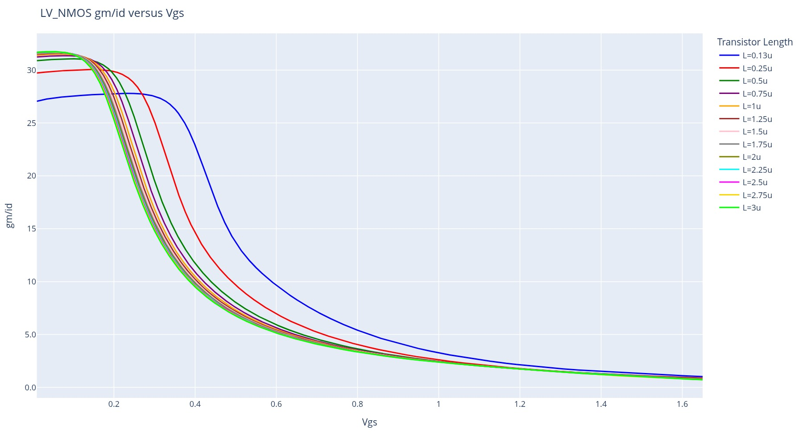

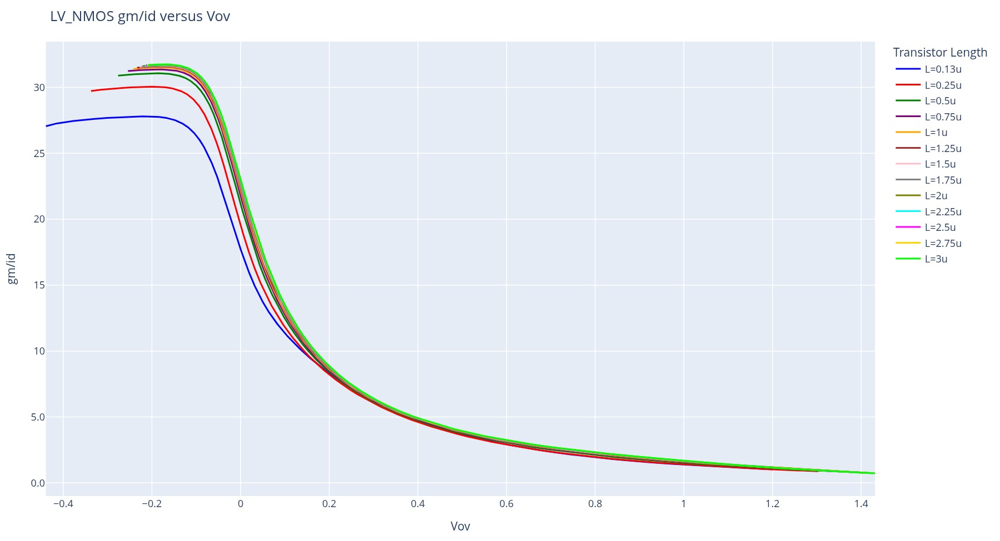

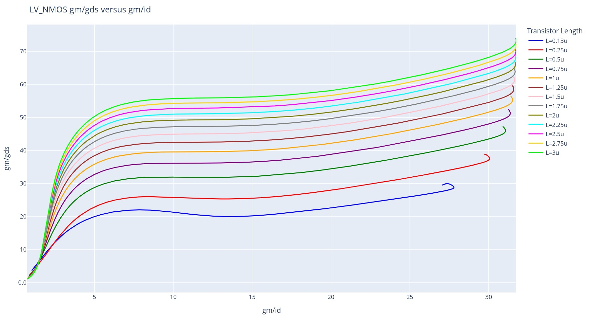

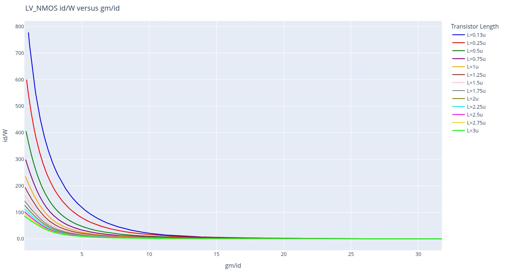

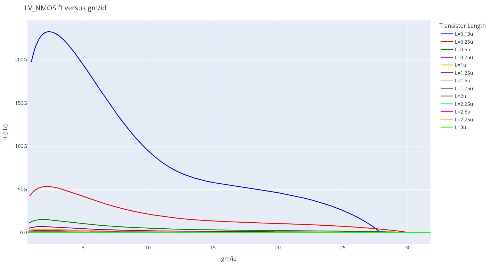

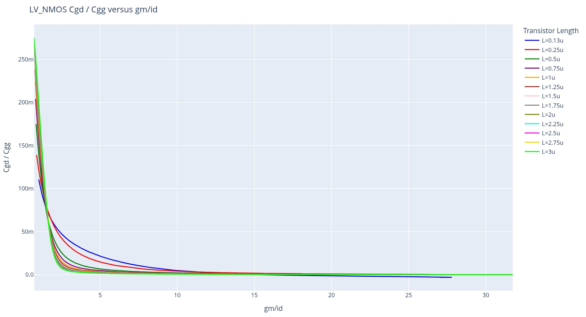

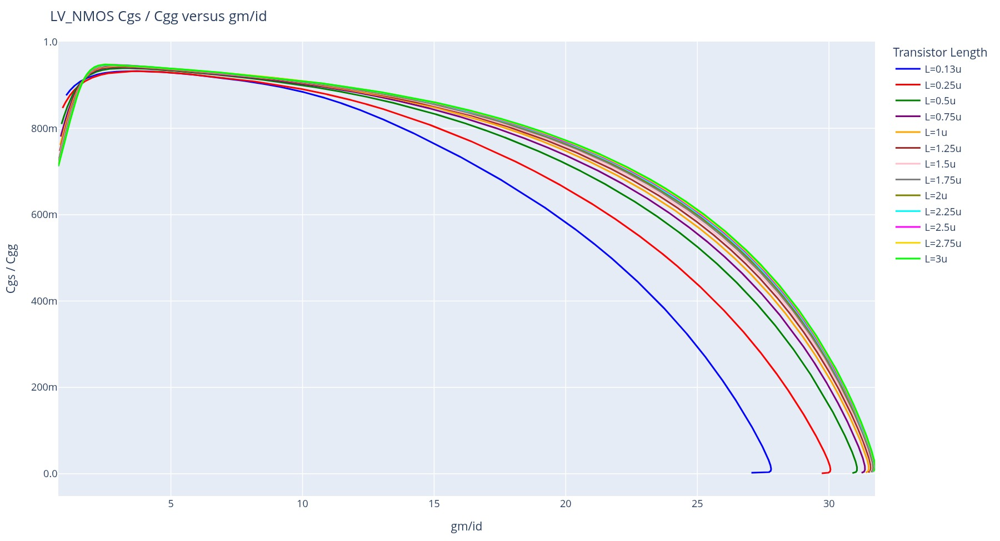

---
## 5.2 $G_m/I_D$ Design Helper
---
Given a target transconductance efficiency $g_m/I_D$ and intrinsic gain $g_m/g_{ds}$,
the helper performs a weighted, $\sigma$-normalised $L_2^2$ nearest-neighbour search
over the LUT:

$$\mathcal{L} = w_1\!\left(\frac{g_m/I_D - \hat{x}_A}{\sigma_A}\right)^{\!2}
              + w_2\!\left(\frac{g_m/g_{ds} - \hat{x}_B}{\sigma_B}\right)^{\!2}$$

where $\sigma_A$, $\sigma_B$ are the dataset standard deviations, making $w_1$, $w_2$
dimensionless and the two axes commensurable. A minimum gain constraint
$\hat{x}_B = \max(g_{m}/g_{ds}\big|_{\text{target}},\, B_{\min})$ is enforced before search.
The best match returns channel length $L$ and current density $I_D/W$,
from which transistor width follows directly:

$$W = \frac{I_D}{(I_D/W)\big|_{\text{LUT}}}$$

### **About the Gm/Id Design Helper Dataset**

The helper runs on **real IHP SG13G2 SPICE characterisation data** loaded by `get_data()` above.
Every point in the scatter plot and every row in the Top-5 table comes directly from the
pre-simulated `.txt` LUT files, the same files used for the gm/id vs Vov characteristic curves.

The two device types available are `LV_NMOS`, `LV_PMOS`.
Each device is characterised across 13 channel lengths (0.13 µm – 3 µm for LV; 0.5 µm – 3 µm for HV),
with a Vgs sweep at fixed W = 2 µm.

### `solve_optimization()` (The Optimizer)

The cell below defines `solve_optimization()` the function that searches the LUT for the operating point closest to your targets:

$$\mathcal{L} = w_1 \left(\frac{g_m/I_D - \hat{x}_A}{\sigma_A}\right)^2 + w_2 \left(\frac{g_m/g_{ds} - \hat{x}_B}{\sigma_B}\right)^2$$

**Why σ-normalise?** $g_m/I_D$ spans roughly $2$–$28\,\text{V}^{-1}$ while $g_m/g_{ds}$ spans $10$–$400$. Without normalisation, $g_m/g_{ds}$ dominates the distance simply because its numbers are larger not because it matters more. Dividing by $\sigma$ puts both terms on the same dimensionless scale, so $w_1$ and $w_2$ are true importance weights.

**The bound constraint:** $\hat{x}_B = \max(B_{\min},\, g_m/g_{ds}\big|_{\text{target}})$ clamps the target upward to the minimum gain bound so the optimiser never recommends a device with gain below your floor.

**Returns:** the top-5 LUT rows sorted by $\mathcal{L}$, the best row, a simulated 6-step convergence trace for display, and $\sigma_A$, $\sigma_B$ (passed to `render_dashboard()` for the loss surface plot).

### `render_dashboard()` (Visualisation Engine)

The cell below defines `render_dashboard()`, the function that runs every time a slider changes.
It does three things:

1. **Filters the LUT** - calls `solve_optimization()` with the current slider values; receives the top-5 matches and the σ-normalised distances.

2. **Draws two panels:**
   - *Left - Scatter plot*: every LUT row as a dot (plasma colourmap by L); the amber ▲ is your target, the green ★ is the best match, the red dashed line is your `gm/gds` lower bound.
   - *Right - Loss surface*: plots the objective function $\mathcal{L}$ vs gm/id (gm/gds held at the optimum). The narrow minimum (green dot) is where the solver landed. A steep, deep minimum means the design point is well-determined; a flat curve means any value in that range is acceptable.

3. **Prints results** - the convergence trace (6 iterative loss values), the optimised metrics (best L, $f_T$, $I_D/W$, device), and the Top-5 colour-coded table (green = best match, red = worst of the five).


### How to Use the Gm/Id Design Helper

This interactive dashboard helps you find the optimal transistor size based on **($g_m/I_D$)** based design methodology.

**Step-by-step:**
1. **Select Devices** - choose `LV_NMOS`, `LV_PMOS` using the multi-select box.
2. **Select Lengths** - pick the channel lengths or all the lengths you want to explore (select the Checkbox to select multiple lengths).
3. **Set Target gm/id** - drag the slider to your desired $g_m/I_D$ value (typical range: 5–25 V⁻¹). Higher $g_m/I_D$ means more efficien (subthreshold region)and lower $g_m/I_D$ means faster but less efficient (strong inversion).
4. **Set Target gm/gds** - this controls intrinsic gain. Higher values give more gain but trade off with speed.
5. **Set Bound** - minimum acceptable $g_m/g_{ds}$ constraint. The optimizer won't accept solutions below this.

**Understanding the Plots:**

- **Scatter (gm/gds vs gm/id):** Each dot is one simulation point, coloured by channel length (plasma colourmap: purple = short L, yellow = long L). The **▲ amber triangle** is your target. The **★ green star** is the best match found. The **red dashed line** is the Bound constraint.
- **Loss Surface:** Shows how the optimizer's cost function varies as gm/id sweeps across its range (gm/gds held at optimum). The minimum of this curve (green dot) is the optimizer's solution. Log-scale Y-axis a steep, narrow minimum means a well-conditioned problem.

**Colour Coding in Top-5 Table:**
- 🟢 **Green** - best match (lowest distance to your query)
- 🟡 **Amber** - moderate match
- 🔴 **Red** - worst of the top 5

**Key Output - OPTIMIZED METRICS:**  
The highlighted green lines show the most important results: the **best matching channel length**, **ft (transition frequency)**, **id/W (current density in µA/µm)**, and **device type**. Use these values to size your transistors.

### Gm/Id Helper Output → Transistor Sizing

---

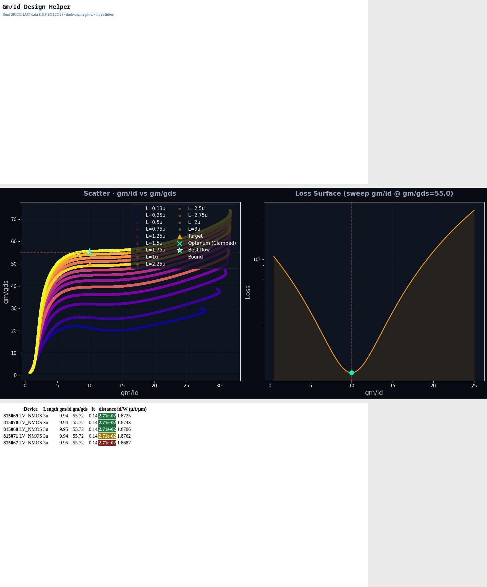

---

The helper returned the following best-match operating points:

| Device | L | $I_D/W$ (µA/µm) | $I_D$ (µA) | $W_{unit}$ (µm) | $f_T$ (GHz) |
|:--|:--|:--|:--|:--|:--|
| **LV_NMOS** | 3.0 µm | 1.8725 µA/µm | 0.5 µA | 0.3 µm | ~0.14 |
| **LV_PMOS** | 0.25 µm | 5.000 µA/µm | 0.5 µA | 0.15 µm | - |

**Width calculation** with unit quiescent current $I_q = 0.5\,\mu\text{A}$:

$$W_{\text{NMOS,unit}} = \frac{0.5\,\mu\text{A}}{1.8725\,\mu\text{A}/\mu\text{m}} \approx 0.3\,\mu\text{m}$$

$$W_{\text{PMOS,unit}} = \frac{0.5\,\mu\text{A}}{5.000\,\mu\text{A}/\mu\text{m}} = 0.1\,\mu\text{m} \approx 0.15\,\mu\text{m}$$

Multiplier $m = 4$ is applied to the signal path to scale $G_m$ to the required 20 µA/V per device type (40 µA/V total):

| Path | Device | $m$ | $W$ (µm) | $L$ (µm) | $I_D$ (µA) |
|:--|:--|:--|:--|:--|:--|
| **Signal** | LV_NMOS | 4 | 0.3 | 3.0 | **2.0** |
| **Signal** | LV_PMOS | 4 | 0.15 | 0.25 | **2.0** |
| **Replica** | LV_NMOS | 1 | 0.3 | 3.0 | **0.5** |
| **Replica** | LV_PMOS | 1 | 0.15 | 0.25 | **0.5** |

The replica path burns $0.5\,\mu\text{A}$ (single unit cell) while the main signal path burns $2\,\mu\text{A}$ (4× unit cell), giving a total quiescent current of $2\,\mu\text{A}$ for whole circuit.

---

> ⚠️ **Critical limitation of the gm/Id approach at this stage:**
> The sizing satisfies the **small-signal bandwidth** target ($G_m \approx 40\,\mu\text{S}$), but gives **no information** about:
> - $R_{on}$ of the output transistors and any information about the Non-Linear settling information(sets non-linear RC settling speed)
> - Deadzone bias voltages $V_{DZP}$ / $V_{DZN}$ (the small-signal settling window)
> - Whether the RC phase even completes within the clock half-cycle
> - Worst-case SS-corner behaviour for any of the above
>
> These unknowns require additional SPICE iterations which is the gap the $R_{on}/g_m$ methodology closes.

---
# Inverter Based Amplifier designed using gm/Id based methodology

Schematic of the testbench for IBA in capacitive feedback in Xschem:
<div align="center">
  
</div>

*Figure 10: Inverter-based amplifier in capacitive feedback configuration designed using the $g_m/I_D$ methodology.*

<br>

---


## 5.3 Results from the IBA designed using **$g_m/I_D$** design methodology

The four figures below are generated from `INV_OTA_gmid.txt`, a transient simulation of the IBA (Inverter-Based Amplifier) sized using the $g_m/I_D$ methodology.

(LV_NMOS: $W = 0.3\,\mu\text{m}$, $L = 3.0\,\mu\text{m}$, $m = 4$; LV_PMOS: $W = 0.15\,\mu\text{m}$, $L = 0.25\,\mu\text{m}$, $m = 4$; $I_{q,replica} = 0.5\,\mu\text{A}$, $I_{q,signal} = 2.0\,\mu\text{A}$)

**What each figure shows and what it exposes about the gm/Id limitation:**

| Figure | Signal plotted | What the code computes | What gm/Id cannot predict pre-simulation |
|:--|:--|:--|:--|
| **Fig 11** : $V_{out}$ | `sv_g` = Vout(t) from file | Direct read from transient file | Whether RC phase completes in time |
| **Fig 12** : Log error | `err_g = (Vout − Vfinal)/Vfinal` | Relative error on log scale; `curve_fit` extracts τ | τ of the RC phase (driven by $R_{on}$) - unknown to gm/Id |
| **Fig 13** : $I_{out}$ | `sm_g` = branch current × 1e6 | Raw current waveform in µA | $I_{peak}$ magnitude - set by $R_{on}$, invisible to gm/Id |
| **Fig 14** : $dV_{out}/dt$ | `dvdt_g = np.gradient(sv_g, st_us_g)` | Numerical derivative = slew rate | Slew rate peak = $I_{peak}/C_L$ - depends on $R_{on}$ |

> The gm/Id design settles correctly, but the designer had no pre-simulation visibility into
> $R_{on}$, the deadzone bias ranges, or the SS-corner worst case
> all of which are characterised pre-simulation in the $R_{on}/g_m$ section that follows.

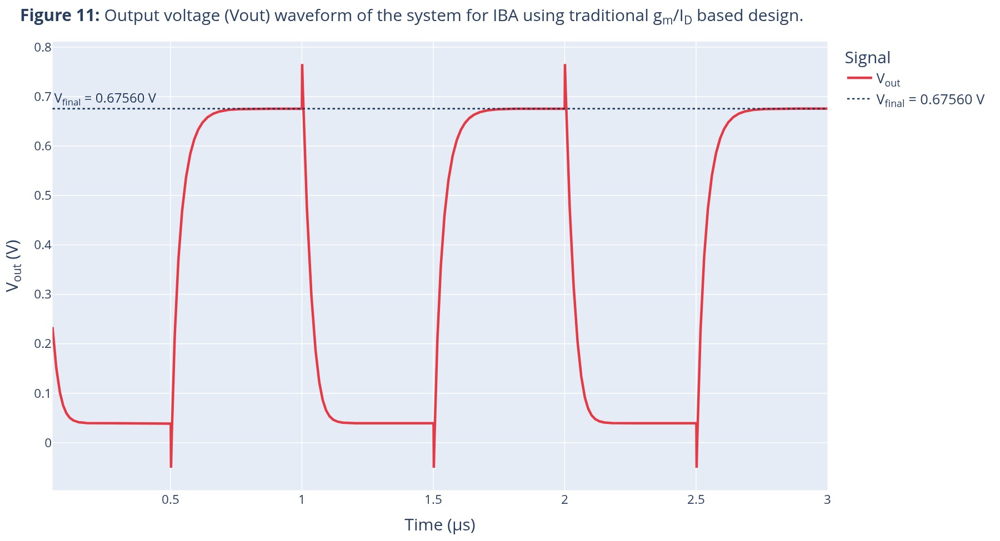

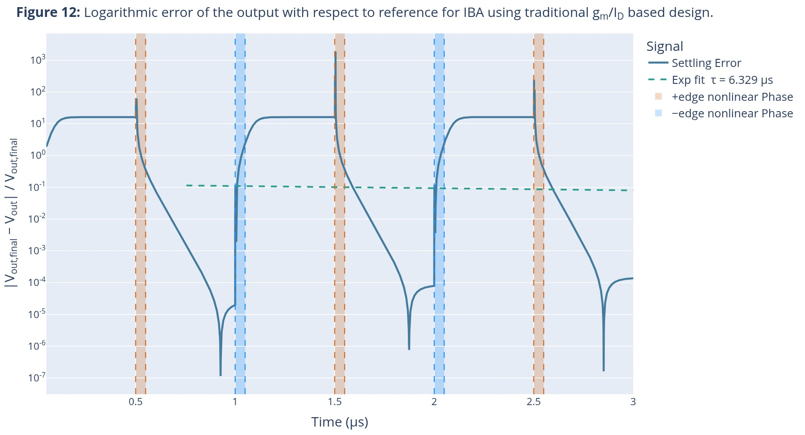

It is observed that the error envelope exhibits **two distinct settling regimes**: an initial rapid decay with a **steep negative slope (500–550 ns)** attributable to **large-signal nonlinear operation**, followed by a gradual exponential decay with a **comparatively smaller slope**, characteristic of **small-signal linear settling**. It is worth noting that the boundary between
these two regimes, and consequently the proportion of the settling window occupied by the nonlinear phase, **cannot be determined beforehand from conventional design methodologies including both the $g_m/I_D$ method and the approach presented by Conrad et al [4].** This information becomes available only upon post-simulation analysis. This constitutes a
**fundamental limitation of conventional design**: the large-signal and
small-signal settling contributions **cannot be independently budgeted or optimized** at the
transistor sizing stage.

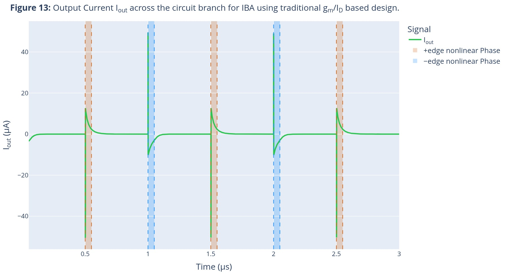

It is observed that the output charging current $I_{out}$ exhibits **two distinct regimes**: an initial **large nonlinear peak current** measured at **+12 µA** on the positive edge and **−10 µA** on the negative edge that rapidly charges/discharges the output load capacitance toward the final value, followed by a progressively decreasing small-signal current with $I_{out} \rightarrow 0$ as the output converges. This behavior is characteristic of dynamic amplifiers: **the bulk of the charge transfer occurs in the initial nonlinear phase**, with the small-signal tail contributing only the final fine settling. Critically, **neither the magnitude of the peak nonlinear current nor the asymmetry between positive and negative edges can be determined beforehand from the $g_m/I_D$ methodology or the approach of Conrad et al. [4]**. Furthermore, this **peak current varies across process corners**, introducing additional uncertainty in the settling budget that remains entirely uncharacterized until post-simulation analysis. This represents a compounded limitation of conventional methodologies: not only is the nonlinear settling duration unknown at the sizing stage, but so is the **magnitude, polarity asymmetry, and corner dependence** of the dominant charging current.

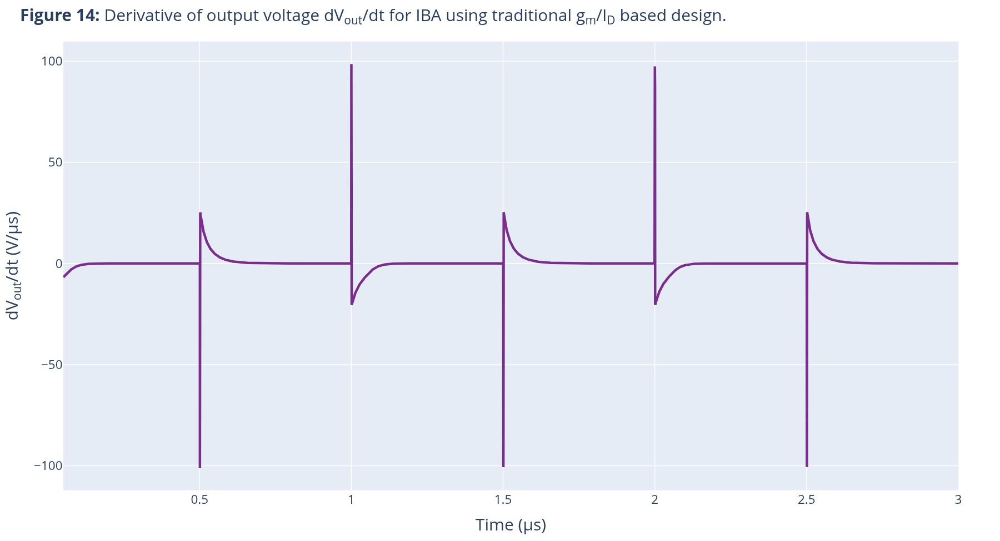

---

## 5.4 Summary of the gm/Id Design and Why We Need to Go Further

---

Figures 10–14 confirmed that the gm/Id-sized IBA settles correctly at **250 ns settling time** (UGB = 9.55 MHz, $\omega_{cl}$ = 20 Mrad/s).
But three critical quantities remained unknown until post-simulation:

| Unknown | What it governs | How discovered in gm/Id flow |
|:--|:--|:--|
| $R_{on}$ of NMOS/PMOS | RC settling time constant $\tau_{ls} = R_{on}C_L$ (the Fig 13 current spike) | Only after transient SPICE |
| Deadzone voltages $V_{DZP}$, $V_{DZN}$ | Define small-signal settling window; too wide = instability | Only after iterative corner sweeps |
| SS-corner $R_{on}$ degradation | Worst-case non-linear settling | Only after running SS corner sim |

The **$R_{on}/g_m$ methodology** below resolves all three simultaneously,
pre-simulation, using the LUT plots generated in the characterisation section.

---


# 6. Design of Inverter-Based Amplifier using the $R_{on}/g_m$ Methodology
---

#### Objective
To design an inverter-based amplifier targeting a **$T_{settle} = 250\,\text{ns}$** settling time (UGB = 9.55 MHz, $\omega_{cl}$ = 20 Mrad/s), while ensuring effective settling behavior and low power consumption through the $R_{on}/g_m$ methodology.

---

#### 1. Transconductance Requirement
- For a settling time $T_{settle} = 250\,\text{ns}$ (5$\tau$), the required closed-loop bandwidth is:
  $$
  \omega_{cl} = \frac{1}{\tau_{cl}} = \frac{5}{T_{settle}} = 20\,\text{Mrad/s}, \qquad \text{UGB} = \frac{\omega_{cl}}{\beta} = \frac{20\,\text{Mrad/s}}{1/3} = 60\,\text{Mrad/s}
  $$

- The total required transconductance is:
  $$
  G_m = \text{UGB} \times C_{L,eff} = 60 \times 10^6 \times 667 \times 10^{-12} \approx 40\,\mu\text{S}
  $$

- Assume NMOS and PMOS contribute equally:
  $$
  g_{mn} = g_{mp} = \frac{G_m}{2} = 20\,\mu\text{S}
  $$


---
#### 2. Target On-Resistance

- To optimize **settling speed and power**, we design assuming **the dominant settling is achieved by the non-linear RC phase**, while the $g_m$-based small-signal phase only removes a small residual.

- With $C_{load} = 667\,\text{fF}$ and $T_{settle} = 250\,\text{ns}$, we target:

  $$R_{on} = 1\,\text{k}\Omega$$

  giving a non-linear settling time of:

  $$5 \times 1\,\text{k}\Omega \times 667\,\text{fF} \approx 3.3\,\text{ns}$$

  This completes the majority of the output swing well within the 250 ns budget.

- The **worst-case $R_{on}$ occurs at the SS corner**, which drives our design:

  $$\frac{R_{\text{on}}}{G_m} = \frac{1\,\text{k}\Omega}{40\,\mu\text{S}} = 25 \times 10^6, \qquad
  \frac{R_{\text{on}}}{g_{mn}} = \frac{R_{\text{on}}}{g_{mp}} = \frac{1\,\text{k}\Omega}{20\,\mu\text{S}} = 50 \times 10^6$$

- Thus, we design at:

  $$R_{on}/g_m = 50 \times 10^6 \quad (\text{per device SS corner})$$

---

### Pre-Simulation Predictions from $R_{on}/g_m$ Plots for NMOS

| Quantity | Source | Pre-Sim Value |
|---|---|---|
| $V_{bias,TT}$ | $V_{bias}$ vs $R_{on}/g_m$ | 0.39 V |
| $V_{bias,SS}$ | $V_{bias}$ vs $R_{on}/g_m$ | 0.42–0.43 V |
| $V_{bias,FF}$ | $V_{bias}$ vs $R_{on}/g_m$ | 0.35–0.36 V |
| $g_m/I_D$ | $g_m/I_D$ vs $R_{on}/g_m$ | $\approx 10$ |
| $I_{peak}$ | $I_{peak}$ vs $R_{on}/g_m$ | $\approx 14\,\mu\text{A}$ |

---

- The $g_m/I_D$ curve confirms **moderate inversion** at this operating point.

- The predicted **peak current**:
  - Pre-simulation: $I_{peak} \approx 14\,\mu\text{A}$
  - Post-simulation: $\approx 12\,\mu\text{A}$  
  → within **~15% accuracy**

- The predicted **deadzone bias voltages**:
  - $V_{DZN}$: Pre-simulation $\approx 0.39\,\text{V}$ (TT) - Post-simulation within $\pm50\,\text{mV}$
  - $V_{DZP}$: Pre-simulation $\approx 1.11\,\text{V}$ (TT) - Post-simulation within $\pm50\,\text{mV}$  
  → corner spread (FF→SS) directly readable from LUT without any transient simulation

- This reveals a **fundamental one-way asymmetry** between the two methodologies:
  - $R_{on}/g_m$: DC bias range, corner spread, $g_m/I_D$ operating point, and $I_{peak}$ are all read **directly from plots before simulation**.
  - $g_m/I_D$ alone: all of the above are **only available after simulation**. The plots provide no path to any large-signal quantity.

  The $R_{on}/g_m$ methodology strictly subsumes $g_m/I_D$; the reverse is impossible.

---
#### 3. Design Units and Scaling
- **Base Units Defined:**
  - $R_{\text{unit}} = 4\,k\Omega$
  - $I_{\text{unit}} = 0.5\,\mu A$
  - $g_{m,\text{unit}} = 5\,\mu\text{S}$ (per device: $5\,\mu\text{S}$ NMOS + $5\,\mu\text{S}$ PMOS = $G_{m,\text{unit}} = 10\,\mu\text{S}$ combined)
  
- The **main path** structure can be scaled using **multipliers** depending on application requirements (e.g., settling time, drive strength).
- The **replica path** can tune $g_m$ independently by adjusting only $I_{\text{unit}}$, leaving the main structure unchanged.

---
#### 4. Insights and Advantages
- This methodology offers deeper understanding of **non-linear settling** by explicitly incorporating $R_{\text{on}}$.
- Provides **predictable Deadzone regions**, eliminating the need for iterative simulations.
- Enables systematic tuning via transistor multipliers:
  - As the **multiplication factor increases**, $R_{\text{on}}$ decreases, further improving performance.

  ---


## 6.1 $R_{on}/G_m$ Design Helper
---

> **Design Step:** The calculation for the unit cell above fixed $R_{on}/g_m = 50\times10^6$ and $I_{bias} = 0.5\,\mu\text{A}$, confirmed by reading Plot 1 and Plot 5.
> Use this helper to search the pre-characterised SPICE LUT for the exact $(W, L, V_{bias})$ that meets these targets at your chosen corner.
> **Set `Ron/gm` to your target → set `i-sweep` to bias current → select SS corner → read the ★ green best-match row.**

An IBA (unlike the three-phase RAMP) operates in two sequential phases.
During the large-signal phase, the output node is driven through the MOSFET switch,
whose on-resistance $R_{on}$ sets the RC settling time constant $\tau_{\text{ls}} = R_{on}C_L$.
During the subsequent small-signal phase, the transconductance $G_m$ sets the
exponential settling time constant $\tau_{\text{ss}} = C_L/G_m$.
Expressed together:

$$\tau_{\text{ls}} = R_{on}C_L, \qquad \tau_{\text{ss}} = \frac{C_L}{g_m}$$

A single $R_{on}/G_m$ target constrains both time constants simultaneously
$R_{on}$ bounds the large-signal settling budget and $G_m$ bounds the small-signal
settling bandwidth without requiring separate iterations.

The LUT is pre-characterised across different $V_{GS}$, $V_{DS}$ (So that user can design the $R_{on}/G_m$ based on the input swing eg., Lets say we want to design the dynamic amplifier for an input swing of VDD/2 or Vdd/4 and so on), channel length $L$,
and process corner. For a specified bias condition $(V_{GS}, V_{DS}, \text{corner})$,
the helper filters the LUT and executes a $\sigma$-normalised $L_2^2$
nearest-neighbour search over the three-dimensional design space
$(I_D,\; (R_{on}/G_m)_{\text{unit}},\; L)$:

$$\mathcal{L} = \left(\frac{I_D - \hat{I}_D}{\sigma_{I}}\right)^{\!2}
              + \left(\frac{(R_{on}/G_m)_{\text{unit}} - \widehat{(R_{on}/G_m)}_{\text{unit}}}{\sigma_{RG}}\right)^{\!2}
              + \left(\frac{L - \hat{L}}{\sigma_{L}}\right)^{\!2}$$

$\sigma$-normalisation is essential: $I_D$, $(R_{on}/G_m)_{\text{unit}}$, and $L$ span
incompatible numerical scales and cannot be combined without it.
The best match returns $V_{\text{bias}}$, device width $W$, and channel length $L$ fully specifying the transistor operating point pre-simulation.


## **How to Use the Ron/gm Design helper**

---


This tool helps the user to size the dynamic amplifier based on $R_{on}/G_m$ based design methodology.

**Step-by-step:**
1. **Select Device** → choose `NMOS`, `PMOS`, or `BOTH`. The VGS/VSG and VDS/VSD dropdowns update automatically to valid sweep values for that device.
2. **Select Corner** → `TT` (typical), `SS` (slow and worst Ron), or `FF` (fast and best Ron). For worst case design, use SS or accordingly.
3. **Select VGS / VSG** → the gate to source voltage. For NMOS this is VGS; for PMOS it is VSG (both positive when the device is on).
4. **Select VDS / VSD** → the drain to source voltage. Use small values (e.g., 0.05 V) to characterise the linear-region $R_{on}$.
5. **Set i-sweep** → the bias current value. Use the slider or type directly in the text box. This corresponds to $I_{bias}$ in the replica path.
6. **Set Ron/Gm** → your target $R_{on}/g_m$ value in Ω·(A/V)⁻¹. Read your required value from the design methodology plots above.
7. **Set length** → target channel length. Longer channels give higher $R_{on}$ and lower $g_{ds}$; shorter channels are faster.

**Understanding the Plots:**

- **Scatter (Ron_Gm vs i-sweep):** Each dot is one simulation point, coloured by channel length (plasma colourmap: **purple = short L** → **yellow = long L**). The **▲ amber triangle** is your query point. The **★ green star** is the nearest match in the LUT. The **red dashed line** marks your Ron/Gm target.
- **Right: Loss Surface:** The cost function sweeping along i-sweep, with Ron/Gm and length held at best-match values. The minimum (green dot) is the optimal bias current. A narrow, deep minimum means the solution is well-determined; a flat curve means the result is insensitive to i-sweep and any value in that region is acceptable.

**Colour Coding in Top-5 Table:**
- 🟢 **Green** - best match (lowest distance to your query)
- 🟡 **Amber** - moderate match
- 🔴 **Red** - worst of the top 5

**Key Output BEST MATCH:**  
After the user input, the printed output shows `width`, `length`, and `v(Vbias)`. The transistor sizing and bias voltage to use in your design. The **Match Quality %** indicates how closely the LUT point matches your target (100% = exact match).

---

## Ron/Gm Helper Output → Transistor Sizing

---

We design it for **SS corner** (worst-case $R_{on}$):

- Target $R_{on}/g_m = 50\times10^6$, $I_{bias} = 0.5\,\mu\text{A}$  

- Since there is **no LUT data for $I_{sweep} = 0.5\,\mu$A**, we scale from the minimum available data:
  - Available: $I_{sweep} = 5\,\mu$A  
  - Required: $I_{sweep} = 0.5\,\mu$A  
  - Scaling factor = **0.1× → Width scales by 0.1**

- **$V_{bias}$ is invariant under this scaling.**  
  $V_{bias}$ sets $V_{GS}$ of the bias-path device. In both weak and strong inversion,
  $V_{GS}$ depends only on the current density $I_D/W$, not on absolute current:
  - Weak inversion: $V_{GS} = V_{th} + nU_T\ln\!\left(\dfrac{I_D \cdot L}{I_0 \cdot W}\right)$ only $I_D/W$ appears.
  - Strong inversion: $V_{GS} - V_{th} = \sqrt{\dfrac{2I_D L}{\mu C_{ox} W}}$ only $I_D/W$ appears.

  Since $I_D$ and $W$ are scaled by the same factor $k$, the ratio $I_D/W$ is unchanged,
  the inversion level is unchanged, and $V_{GS} = V_{bias}$ is unchanged.
  This is the same invariant that underpins the $g_m/I_D$ methodology.

---

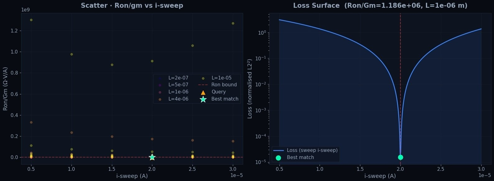

---

### Reference from Ron/gm Helper ($I_{sweep} = 5\,\mu$A)

- **NMOS:** $W = 5\,\mu\text{m},\; L = 4\,\mu\text{m}$  
- **PMOS:** $W = 1\,\mu\text{m},\; L = 0.2\,\mu\text{m}$  

---

### Scaled Design ($I_{sweep} = 0.5\,\mu$A)

Applying **width scaling (×0.1):**

- **NMOS:**  
  $W = 0.5\,\mu\text{m},\; L = 3\text{–}4\,\mu\text{m}$  
  $V_{DZN} \approx 0.34\,\text{V}$ (TT)

- **PMOS:**  
  $W = 0.1\,\mu\text{m} \approx 0.15\,\mu\text{m},\; L = 0.2\,\mu\text{m}$  
  $V_{DZP} \approx 1.11\,\text{V}$ (TT)

---

These values are **consistent with gm/Id estimates**, while additionally providing:
- Direct control over $R_{on}/g_m$
- Deadzone bias voltages at **SS corner**

---

### Peak Current (Worst-Case)

- I_peak(maximum Non-linear current) ≈ 14 µA (pre-simulation prediction)
Post-simulation: ≈ 12 µA (≈15% deviation)

---

### Key Insight

> Unlike gm/Id, this method allows **direct scaling across current levels** while preserving $R_{on}/g_m$, enabling reliable sizing even when LUT data is unavailable at the target bias.

---


# 6.2 Inverter Based Amplifier design Results: $R_{on}/g_m$ Methodology

## Schematic
Schematic of the inverter-based amplifier with capacitive feedback, designed using the $R_{on}/g_m$ methodology:

<div align="center">
  
</div>

*Fig. 15: Inverter-based amplifier in capacitive feedback configuration designed using the $R_{on}/g_m$ methodology.*


## 6.3 Results from the IBA designed using **$R_{on}/g_m$** design methodology

The four figures below are generated from `INV_OTA_rongm.txt`, a transient simulation of the IBA sized using the $R_{on}/g_m$ methodology.

(LV_NMOS: $W = 0.5\,\mu\text{m}$, $L = 3.0\,\mu\text{m}$, $m = 4$; LV_PMOS: $W = 0.15\,\mu\text{m}$, $L = 0.2\,\mu\text{m}$, $m = 4$; $I_{q,replica} = 0.5\,\mu\text{A}$, $I_{q,signal} = 2.0\,\mu\text{A}$)

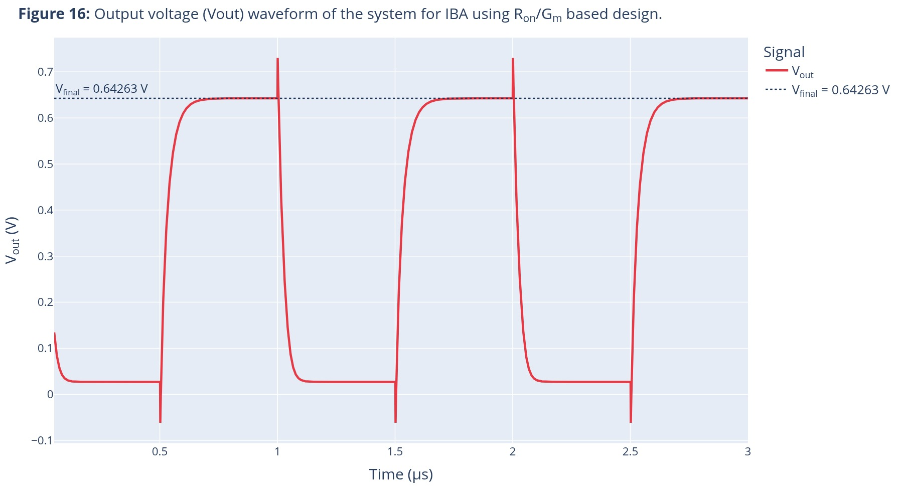

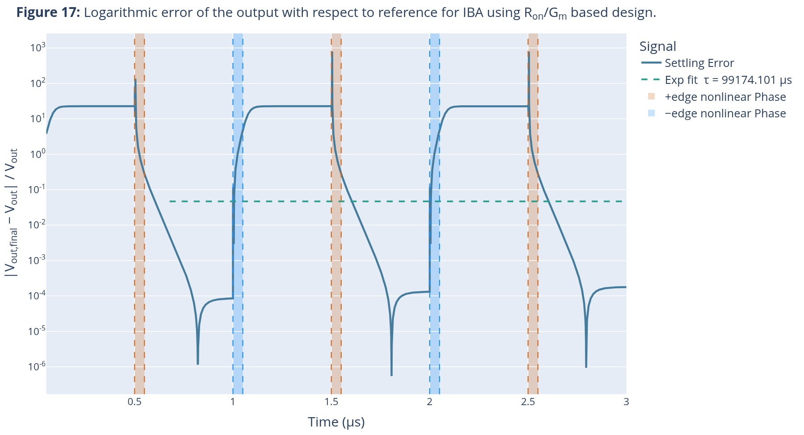

It is observed that the error envelope exhibits **two distinct settling regimes**: an initial rapid decay with a **steep negative slope (500–550 ns)** attributable to **large-signal nonlinear operation**, followed by a gradual exponential decay with a **comparatively smaller slope**, characteristic of **small-signal linear settling**. It is worth noting that the boundary between
these two regimes, and consequently the proportion of the settling window occupied by the nonlinear phase, **determined beforehand from $R_{on}/g_m$ design methodology.** This information was ready with users before simulation analysis. This constitutes a
**fundamental difference and improvement over conventional design methodology**: the large-signal and
small-signal settling contributions **can be independently budgeted or optimized** at the
transistor sizing stage.

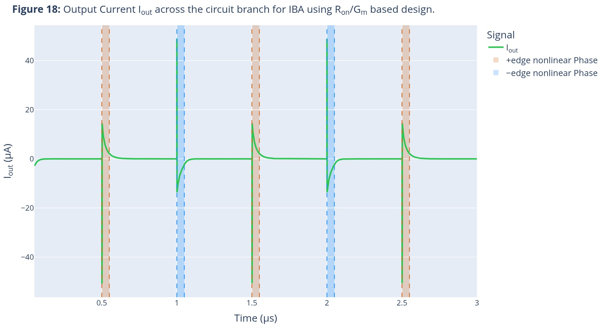

It is observed that the output charging current $I_{out}$ exhibits **two distinct regimes**: an initial **large nonlinear peak current** measured at **+14 µA**(positive edge) on the positive edge and **−13.86 µA**(negative edge) on the negative edge that rapidly charges/discharges the output load capacitance toward the final value, followed by a progressively decreasing small-signal current with $I_{out} \rightarrow 0$ as the output converges. This behavior is characteristic of dynamic amplifiers: **the bulk of the charge transfer occurs in the initial nonlinear phase**, with the small-signal tail contributing only the final fine settling. This was **determined beforehand by the $R_{on}/g_m$ methodology where $g_m/I_d$ or the approach of Conrad et al [4] failed to do so.**. Furthermore, this **peak current varies across process corners**, introducing additional uncertainty in the settling budget is now predictable pre-simulation. This represents a great improvement over conventional methodologies: not only is the nonlinear settling duration known at the sizing stage, but so is the **magnitude, polarity asymmetry, and corner dependence** of the dominant charging current.


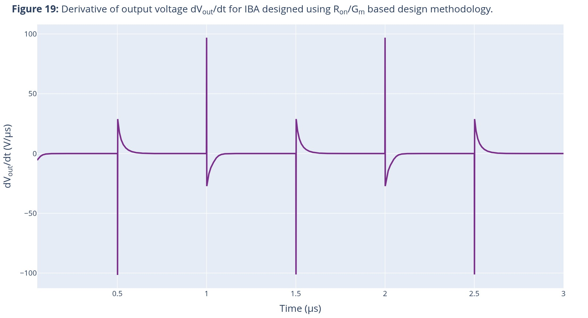

<hr>

# 7. Comparative Analysis

A structured comparison of the $R_{on}/g_m$ methodology against the $g_m/I_D$ methodology and the Conrad *et al.* [TCAS-I 2020] numerical optimizer is presented below. The table covers methodology paradigm, settling phase coverage, process corner robustness, design equations, practical flow, and concrete design example results across all three approaches.

---


## PERFORMANCE SUMMARY AND COMPARISON WITH STATE-OF-THE-ART

<div style="overflow-x:auto; width:100%;">
<table style="width:100%; border-collapse:collapse; border-top:2px solid #000; border-bottom:2px solid #000; table-layout:fixed; font-family:'Times New Roman',serif; font-size:9pt;">
<colgroup><col style="width:28%;"><col style="width:24%;"><col style="width:24%;"><col style="width:24%;"></colgroup>
<thead>
<tr>
  <th style="text-align:left; padding:6px 7px; border-bottom:1px solid #000; font-weight:bold; word-break:break-word; overflow-wrap:anywhere; white-space:normal; max-width:0;">Design Criterion</th>
  <th style="text-align:center; padding:6px 7px; border-bottom:1px solid #000; font-weight:bold; background:#f0f0f0; word-break:break-word; overflow-wrap:anywhere; white-space:normal; max-width:0;"><i>R</i><sub>on</sub>/<i>g</i><sub>m</sub> <b>(This Work)</b></th>
  <th style="text-align:center; padding:6px 7px; border-bottom:1px solid #000; font-weight:bold; word-break:break-word; overflow-wrap:anywhere; white-space:normal; max-width:0;"><i>g</i><sub>m</sub>/<i>I</i><sub>D</sub> Methodology</th>
  <th style="text-align:center; padding:6px 7px; border-bottom:1px solid #000; font-weight:bold; word-break:break-word; overflow-wrap:anywhere; white-space:normal; max-width:0;">Conrad <i>et al.</i> [TCAS-I 2020]</th>
</tr>
</thead>
<tbody>

<!-- ── I ── -->
<tr><td colspan="4" style="background:#000; color:#fff; font-weight:bold; font-size:8.5pt; letter-spacing:.06em; padding:3px 8px; max-width:none;">I. &nbsp;METHODOLOGY</td></tr>

<tr>
  <td style="text-align:left; padding:5px 7px; border-bottom:0.5px solid #ddd; vertical-align:top; word-break:break-word; overflow-wrap:anywhere; white-space:normal; max-width:0;">Design paradigm</td>
  <td style="text-align:center; padding:5px 7px; border-bottom:0.5px solid #ddd; vertical-align:top; word-break:break-word; overflow-wrap:anywhere; white-space:normal; max-width:0; background:#fafafa;">Analytical LUT<br><small><i>Physics-based; pre-characterised</i></small></td>
  <td style="text-align:center; padding:5px 7px; border-bottom:0.5px solid #ddd; vertical-align:top; word-break:break-word; overflow-wrap:anywhere; white-space:normal; max-width:0;">Analytical LUT<br><small><i>Small-signal only</i></small></td>
  <td style="text-align:center; padding:5px 7px; border-bottom:0.5px solid #ddd; vertical-align:top; word-break:break-word; overflow-wrap:anywhere; white-space:normal; max-width:0;">Simulation-based numerical optimizer<br><small><i>Cadence ADE XL</i></small></td>
</tr>

<tr>
  <td style="text-align:left; padding:5px 7px; border-bottom:0.5px solid #ddd; vertical-align:top; word-break:break-word; overflow-wrap:anywhere; white-space:normal; max-width:0;">Primary design parameter</td>
  <td style="text-align:center; padding:5px 7px; border-bottom:0.5px solid #ddd; vertical-align:top; word-break:break-word; overflow-wrap:anywhere; white-space:normal; max-width:0; background:#fafafa;"><i>R</i><sub>on</sub>/<i>g</i><sub>m</sub><br><small><i>Couples large-signal + small-signal</i></small></td>
  <td style="text-align:center; padding:5px 7px; border-bottom:0.5px solid #ddd; vertical-align:top; word-break:break-word; overflow-wrap:anywhere; white-space:normal; max-width:0;"><i>g</i><sub>m</sub>/<i>I</i><sub>D</sub><br><small><i>Small-signal only</i></small></td>
  <td style="text-align:center; padding:5px 7px; border-bottom:0.5px solid #ddd; vertical-align:top; word-break:break-word; overflow-wrap:anywhere; white-space:normal; max-width:0;"><i>m</i><sub>a1</sub>, <i>m</i><sub>a2</sub>, <i>m</i><sub>a3</sub>, <i>I</i><sub>bias</sub>, <i>R</i>, <i>C</i><sub>az</sub><br><small><i>6 numerical params; no physical link</i></small></td>
</tr>

<tr>
  <td style="text-align:left; padding:5px 7px; border-bottom:0.5px solid #ddd; vertical-align:top; word-break:break-word; overflow-wrap:anywhere; white-space:normal; max-width:0;">Design entry stage</td>
  <td style="text-align:center; padding:5px 7px; border-bottom:0.5px solid #ddd; vertical-align:top; word-break:break-word; overflow-wrap:anywhere; white-space:normal; max-width:0; background:#fafafa;">Pre-simulation</td>
  <td style="text-align:center; padding:5px 7px; border-bottom:0.5px solid #ddd; vertical-align:top; word-break:break-word; overflow-wrap:anywhere; white-space:normal; max-width:0;">Pre-simulation<br><small><i>Partial - no large-signal info</i></small></td>
  <td style="text-align:center; padding:5px 7px; border-bottom:0.5px solid #ddd; vertical-align:top; word-break:break-word; overflow-wrap:anywhere; white-space:normal; max-width:0;">Requires full transient simulation per iteration</td>
</tr>

<!-- ── II ── -->
<tr><td colspan="4" style="background:#000; color:#fff; font-weight:bold; font-size:8.5pt; letter-spacing:.06em; padding:3px 8px; max-width:none;">II. &nbsp;SETTLING PHASE COVERAGE</td></tr>

<tr>
  <td style="text-align:left; padding:5px 7px; border-bottom:0.5px solid #ddd; vertical-align:top; word-break:break-word; overflow-wrap:anywhere; white-space:normal; max-width:0;">Non-linear (large-signal / RC) settling characterized</td>
  <td style="text-align:center; padding:5px 7px; border-bottom:0.5px solid #ddd; vertical-align:top; word-break:break-word; overflow-wrap:anywhere; white-space:normal; max-width:0; background:#fafafa;"><br><small><i>Via R<sub>on</sub> in LUT; τ<sub>ls</sub> = R<sub>on</sub>C<sub>L</sub></i></small></td>
  <td style="text-align:center; padding:5px 7px; border-bottom:0.5px solid #ddd; vertical-align:top; word-break:break-word; overflow-wrap:anywhere; white-space:normal; max-width:0;"><br><small><i>R<sub>on</sub> absent from g<sub>m</sub>/I<sub>D</sub> framework</i></small></td>
  <td style="text-align:center; padding:5px 7px; border-bottom:0.5px solid #ddd; vertical-align:top; word-break:break-word; overflow-wrap:anywhere; white-space:normal; max-width:0;"><br><small><i>Acknowledged as "not practical" [4]†</i></small></td>
</tr>

<tr>
  <td style="text-align:left; padding:5px 7px; border-bottom:0.5px solid #ddd; vertical-align:top; word-break:break-word; overflow-wrap:anywhere; white-space:normal; max-width:0;">Small-signal (<i>g</i><sub>m</sub>C) settling characterized</td>
  <td style="text-align:center; padding:5px 7px; border-bottom:0.5px solid #ddd; vertical-align:top; word-break:break-word; overflow-wrap:anywhere; white-space:normal; max-width:0; background:#fafafa;"><br><small><i>Via g<sub>m,bias</sub> in LUT; BW = g<sub>m</sub>/(2π C<sub>L</sub>)</i></small></td>
  <td style="text-align:center; padding:5px 7px; border-bottom:0.5px solid #ddd; vertical-align:top; word-break:break-word; overflow-wrap:anywhere; white-space:normal; max-width:0;"><br><small><i>Primary strength of g<sub>m</sub>/I<sub>D</sub> methodology</i></small></td>
  <td style="text-align:center; padding:5px 7px; border-bottom:0.5px solid #ddd; vertical-align:top; word-break:break-word; overflow-wrap:anywhere; white-space:normal; max-width:0;"><br><small><i>Via rms error cost function</i></small></td>
</tr>

<tr>
  <td style="text-align:left; padding:5px 7px; border-bottom:0.5px solid #ddd; vertical-align:top; word-break:break-word; overflow-wrap:anywhere; white-space:normal; max-width:0;">Unified two-phase settling model</td>
  <td style="text-align:center; padding:5px 7px; border-bottom:0.5px solid #ddd; vertical-align:top; word-break:break-word; overflow-wrap:anywhere; white-space:normal; max-width:0; background:#fafafa;"><br><small><i>R<sub>on</sub>/g<sub>m</sub> co-constrains both τ<sub>LS</sub> and τ<sub>SS</sub></i></small></td>
  <td style="text-align:center; padding:5px 7px; border-bottom:0.5px solid #ddd; vertical-align:top; word-break:break-word; overflow-wrap:anywhere; white-space:normal; max-width:0;"><br><small><i>Small-signal-phase only</i></small></td>
  <td style="text-align:center; padding:5px 7px; border-bottom:0.5px solid #ddd; vertical-align:top; word-break:break-word; overflow-wrap:anywhere; white-space:normal; max-width:0;"><br><small><i>No time-budget allocation between phases</i></small></td>
</tr>

<tr>
  <td style="text-align:left; padding:5px 7px; border-bottom:0.5px solid #ddd; vertical-align:top; word-break:break-word; overflow-wrap:anywhere; white-space:normal; max-width:0;">Peak slew current <i>I</i><sub>peak</sub> predicted pre-simulation</td>
  <td style="text-align:center; padding:5px 7px; border-bottom:0.5px solid #ddd; vertical-align:top; word-break:break-word; overflow-wrap:anywhere; white-space:normal; max-width:0; background:#fafafa;"><br><small><i>I<sub>peak</sub> ∝ 1/(R<sub>on</sub>/g<sub>m</sub>); log-log scale slope = −1</i></small></td>
  <td style="text-align:center; padding:5px 7px; border-bottom:0.5px solid #ddd; vertical-align:top; word-break:break-word; overflow-wrap:anywhere; white-space:normal; max-width:0;"></td>
  <td style="text-align:center; padding:5px 7px; border-bottom:0.5px solid #ddd; vertical-align:top; word-break:break-word; overflow-wrap:anywhere; white-space:normal; max-width:0;"><br><small><i>Post-optimization verification only</i></small></td>
</tr>

<!-- ── III ── -->
<tr><td colspan="4" style="background:#000; color:#fff; font-weight:bold; font-size:8.5pt; letter-spacing:.06em; padding:3px 8px; max-width:none;">III. &nbsp;PROCESS CORNER ROBUSTNESS</td></tr>

<tr>
  <td style="text-align:left; padding:5px 7px; border-bottom:0.5px solid #ddd; vertical-align:top; word-break:break-word; overflow-wrap:anywhere; white-space:normal; max-width:0;">TT / SS / FF corners visible at design entry</td>
  <td style="text-align:center; padding:5px 7px; border-bottom:0.5px solid #ddd; vertical-align:top; word-break:break-word; overflow-wrap:anywhere; white-space:normal; max-width:0; background:#fafafa;"><br><small><i>All 3 corners in LUT; SS worst-case directly readable</i></small></td>
  <td style="text-align:center; padding:5px 7px; border-bottom:0.5px solid #ddd; vertical-align:top; word-break:break-word; overflow-wrap:anywhere; white-space:normal; max-width:0;"><br><small><i>LUT can be corner-swept but R<sub>on</sub> not extracted</i></small></td>
  <td style="text-align:center; padding:5px 7px; border-bottom:0.5px solid #ddd; vertical-align:top; word-break:break-word; overflow-wrap:anywhere; white-space:normal; max-width:0;"><br><small><i>PVT excluded from optimizer loop‡</i></small></td>
</tr>

<tr>
  <td style="text-align:left; padding:5px 7px; border-bottom:0.5px solid #ddd; vertical-align:top; word-break:break-word; overflow-wrap:anywhere; white-space:normal; max-width:0;">Deadzone bias (<i>V</i><sub>DZN</sub>, <i>V</i><sub>DZP</sub>) determined pre-simulation</td>
  <td style="text-align:center; padding:5px 7px; border-bottom:0.5px solid #ddd; vertical-align:top; word-break:break-word; overflow-wrap:anywhere; white-space:normal; max-width:0; background:#fafafa;"><br><small><i>Per-corner, from V<sub>bias</sub> vs R<sub>on</sub>/g<sub>m</sub> plot§</i></small></td>
  <td style="text-align:center; padding:5px 7px; border-bottom:0.5px solid #ddd; vertical-align:top; word-break:break-word; overflow-wrap:anywhere; white-space:normal; max-width:0;"><br><small><i>Unknown without iterative transient corner sweeps</i></small></td>
  <td style="text-align:center; padding:5px 7px; border-bottom:0.5px solid #ddd; vertical-align:top; word-break:break-word; overflow-wrap:anywhere; white-space:normal; max-width:0;"><br><small><i>V<sub>os</sub> is one of 6 optimized params; corner sensitivity unknown a priori</i></small></td>
</tr>

<tr>
  <td style="text-align:left; padding:5px 7px; border-bottom:0.5px solid #ddd; vertical-align:top; word-break:break-word; overflow-wrap:anywhere; white-space:normal; max-width:0;">SS-corner <i>R</i><sub>on</sub> degradation visible a priori</td>
  <td style="text-align:center; padding:5px 7px; border-bottom:0.5px solid #ddd; vertical-align:top; word-break:break-word; overflow-wrap:anywhere; white-space:normal; max-width:0; background:#fafafa;"></td>
  <td style="text-align:center; padding:5px 7px; border-bottom:0.5px solid #ddd; vertical-align:top; word-break:break-word; overflow-wrap:anywhere; white-space:normal; max-width:0;"></td>
  <td style="text-align:center; padding:5px 7px; border-bottom:0.5px solid #ddd; vertical-align:top; word-break:break-word; overflow-wrap:anywhere; white-space:normal; max-width:0;"></td>
</tr>

<!-- ── IV ── -->
<tr><td colspan="4" style="background:#000; color:#fff; font-weight:bold; font-size:8.5pt; letter-spacing:.06em; padding:3px 8px; max-width:none;">IV. &nbsp;DESIGN EQUATIONS AND PHYSICAL INSIGHT</td></tr>

<tr>
  <td style="text-align:left; padding:5px 7px; border-bottom:0.5px solid #ddd; vertical-align:top; word-break:break-word; overflow-wrap:anywhere; white-space:normal; max-width:0;">Closed-form design equations available</td>
  <td style="text-align:center; padding:5px 7px; border-bottom:0.5px solid #ddd; vertical-align:top; word-break:break-word; overflow-wrap:anywhere; white-space:normal; max-width:0; background:#fafafa;"><br><small><i>V<sub>bias</sub> = V<sub>TH</sub> + 2I<sub>D</sub>/g<sub>m</sub>;<br>g<sub>m,bias</sub> ∝ (R<sub>on</sub>/g<sub>m</sub>)<sup>−1/3</sup>;<br>R<sub>on</sub>/g<sub>m</sub> ∝ L²/(W·I<sub>D</sub>)</i></small></td>
  <td style="text-align:center; padding:5px 7px; border-bottom:0.5px solid #ddd; vertical-align:top; word-break:break-word; overflow-wrap:anywhere; white-space:normal; max-width:0;"><br><small><i>For small-signal: G<sub>m</sub> = 2πfC<sub>L</sub>;<br>W = I<sub>D</sub> / (I<sub>D</sub>/W)|<sub>LUT</sub></i></small></td>
  <td style="text-align:center; padding:5px 7px; border-bottom:0.5px solid #ddd; vertical-align:top; word-break:break-word; overflow-wrap:anywhere; white-space:normal; max-width:0;"><br><small><i>Stability criterion exists but "not realizable" as design equation†</i></small></td>
</tr>

<tr>
  <td style="text-align:left; padding:5px 7px; border-bottom:0.5px solid #ddd; vertical-align:top; word-break:break-word; overflow-wrap:anywhere; white-space:normal; max-width:0;">Physical insight preserved throughout design</td>
  <td style="text-align:center; padding:5px 7px; border-bottom:0.5px solid #ddd; vertical-align:top; word-break:break-word; overflow-wrap:anywhere; white-space:normal; max-width:0; background:#fafafa;"><br><small><i>Every plot axis maps to a physical quantity</i></small></td>
  <td style="text-align:center; padding:5px 7px; border-bottom:0.5px solid #ddd; vertical-align:top; word-break:break-word; overflow-wrap:anywhere; white-space:normal; max-width:0;"><br><small><i>For small-signal operating point only</i></small></td>
  <td style="text-align:center; padding:5px 7px; border-bottom:0.5px solid #ddd; vertical-align:top; word-break:break-word; overflow-wrap:anywhere; white-space:normal; max-width:0;"><br><small><i>Optimizer returns numbers; no physical link retained</i></small></td>
</tr>

<tr>
  <td style="text-align:left; padding:5px 7px; border-bottom:0.5px solid #ddd; vertical-align:top; word-break:break-word; overflow-wrap:anywhere; white-space:normal; max-width:0;">Subsumes <i>g</i><sub>m</sub>/<i>I</i><sub>D</sub> methodology</td>
  <td style="text-align:center; padding:5px 7px; border-bottom:0.5px solid #ddd; vertical-align:top; word-break:break-word; overflow-wrap:anywhere; white-space:normal; max-width:0; background:#fafafa;"><br><small><i>g<sub>m</sub>/I<sub>D</sub> readable from g<sub>m</sub>/I<sub>D</sub> vs R<sub>on</sub>/g<sub>m</sub> plot; reverse not possible</i></small></td>
  <td style="text-align:center; padding:5px 7px; border-bottom:0.5px solid #ddd; vertical-align:top; word-break:break-word; overflow-wrap:anywhere; white-space:normal; max-width:0;">-</td>
  <td style="text-align:center; padding:5px 7px; border-bottom:0.5px solid #ddd; vertical-align:top; word-break:break-word; overflow-wrap:anywhere; white-space:normal; max-width:0;"></td>
</tr>

<!-- ── V ── -->
<tr><td colspan="4" style="background:#000; color:#fff; font-weight:bold; font-size:8.5pt; letter-spacing:.06em; padding:3px 8px; max-width:none;">V. &nbsp;PRACTICAL DESIGN FLOW</td></tr>

<tr>
  <td style="text-align:left; padding:5px 7px; border-bottom:0.5px solid #ddd; vertical-align:top; word-break:break-word; overflow-wrap:anywhere; white-space:normal; max-width:0;">EDA tool requirement</td>
  <td style="text-align:center; padding:5px 7px; border-bottom:0.5px solid #ddd; vertical-align:top; word-break:break-word; overflow-wrap:anywhere; white-space:normal; max-width:0; background:#fafafa;">Open-source and Commercial tools<br><small><i>Any spice + Python/Matlab</i></small></td>
  <td style="text-align:center; padding:5px 7px; border-bottom:0.5px solid #ddd; vertical-align:top; word-break:break-word; overflow-wrap:anywhere; white-space:normal; max-width:0;">Spectre (LUT gen.)<br><small><i>Helper usable standalone</i></small></td>
  <td style="text-align:center; padding:5px 7px; border-bottom:0.5px solid #ddd; vertical-align:top; word-break:break-word; overflow-wrap:anywhere; white-space:normal; max-width:0;">Cadence Virtuoso + Spectre + ADE XL<br><small><i>Full commercial license stack</i></small></td>
</tr>

<tr>
  <td style="text-align:left; padding:5px 7px; border-bottom:0.5px solid #ddd; vertical-align:top; word-break:break-word; overflow-wrap:anywhere; white-space:normal; max-width:0;">Application-specific redesign required</td>
  <td style="text-align:center; padding:5px 7px; border-bottom:0.5px solid #ddd; vertical-align:top; word-break:break-word; overflow-wrap:anywhere; white-space:normal; max-width:0; background:#fafafa;"><br><small><i>LUT generated once per technology node</i></small></td>
  <td style="text-align:center; padding:5px 7px; border-bottom:0.5px solid #ddd; vertical-align:top; word-break:break-word; overflow-wrap:anywhere; white-space:normal; max-width:0;"><br><small><i>LUT reusable across applications</i></small></td>
  <td style="text-align:center; padding:5px 7px; border-bottom:0.5px solid #ddd; vertical-align:top; word-break:break-word; overflow-wrap:anywhere; white-space:normal; max-width:0;"><br><small><i>New testbench + cost function per application</i></small></td>
</tr>

<tr>
  <td style="text-align:left; padding:5px 7px; border-bottom:0.5px solid #ddd; vertical-align:top; word-break:break-word; overflow-wrap:anywhere; white-space:normal; max-width:0;">Cost function calibration required</td>
  <td style="text-align:center; padding:5px 7px; border-bottom:0.5px solid #ddd; vertical-align:top; word-break:break-word; overflow-wrap:anywhere; white-space:normal; max-width:0; background:#fafafa;"></td>
  <td style="text-align:center; padding:5px 7px; border-bottom:0.5px solid #ddd; vertical-align:top; word-break:break-word; overflow-wrap:anywhere; white-space:normal; max-width:0;"></td>
  <td style="text-align:center; padding:5px 7px; border-bottom:0.5px solid #ddd; vertical-align:top; word-break:break-word; overflow-wrap:anywhere; white-space:normal; max-width:0;"><br><small><i>Manual ×4 adjustment applied in paper¶</i></small></td>
</tr>

<tr>
  <td style="text-align:left; padding:5px 7px; border-bottom:0.5px solid #ddd; vertical-align:top; word-break:break-word; overflow-wrap:anywhere; white-space:normal; max-width:0;">PVT robustness in design loop</td>
  <td style="text-align:center; padding:5px 7px; border-bottom:0.5px solid #ddd; vertical-align:top; word-break:break-word; overflow-wrap:anywhere; white-space:normal; max-width:0; background:#fafafa;"><br><small><i>SS/FF corner LUTs included by design</i></small></td>
  <td style="text-align:center; padding:5px 7px; border-bottom:0.5px solid #ddd; vertical-align:top; word-break:break-word; overflow-wrap:anywhere; white-space:normal; max-width:0;"><br><small><i>Corner LUT possible; dynamic behavior not covered</i></small></td>
  <td style="text-align:center; padding:5px 7px; border-bottom:0.5px solid #ddd; vertical-align:top; word-break:break-word; overflow-wrap:anywhere; white-space:normal; max-width:0;"><br><small><i>Excluded from optimizer; post-hoc Monte Carlo only‡</i></small></td>
</tr>

<tr>
  <td style="text-align:left; padding:5px 7px; border-bottom:0.5px solid #ddd; vertical-align:top; word-break:break-word; overflow-wrap:anywhere; white-space:normal; max-width:0;">Technology portability</td>
  <td style="text-align:center; padding:5px 7px; border-bottom:0.5px solid #ddd; vertical-align:top; word-break:break-word; overflow-wrap:anywhere; white-space:normal; max-width:0; background:#fafafa;"><br><small><i>15 ngspice sims re-characterize any PDK (~1 min)</i></small></td>
  <td style="text-align:center; padding:5px 7px; border-bottom:0.5px solid #ddd; vertical-align:top; word-break:break-word; overflow-wrap:anywhere; white-space:normal; max-width:0;"><br><small><i>New Spectre LUT per node</i></small></td>
  <td style="text-align:center; padding:5px 7px; border-bottom:0.5px solid #ddd; vertical-align:top; word-break:break-word; overflow-wrap:anywhere; white-space:normal; max-width:0;"><br><small><i>Full optimizer rerun needed; 180 nm fails power target by 13×**</i></small></td>
</tr>
<!-- ── VI ── -->
<tr><td colspan="4" style="background:#000; color:#fff; font-weight:bold; font-size:8.5pt; letter-spacing:.06em; padding:3px 8px; max-width:none;">VI. &nbsp;DESIGN EXAMPLE RESULTS (IBA, T<sub>settle</sub> = 250 ns, UGB = 9.55 MHz (60 Mrad/s), C<sub>L,eff</sub> = 667 fF, IHP SG13G2 130 nm)</td></tr>

<tr>
  <td style="text-align:left; padding:5px 7px; border-bottom:0.5px solid #ddd;"><i>G</i><sub>m</sub> target met (UGB = 9.55 MHz)</td>
  <td style="text-align:center; padding:5px 7px; border-bottom:0.5px solid #ddd; background:#fafafa;"> ≈ 40 µS</td>
  <td style="text-align:center; padding:5px 7px; border-bottom:0.5px solid #ddd;"> ≈ 40 µS</td>
  <td style="text-align:center; padding:5px 7px; border-bottom:0.5px solid #ddd;"> 15-bit ENOB</td>
</tr>

<tr>
  <td style="text-align:left; padding:5px 7px; border-bottom:0.5px solid #ddd;"><i>I</i><sub>peak</sub> range</td>
  <td style="text-align:center; padding:5px 7px; border-bottom:0.5px solid #ddd; background:#fafafa;"><br><small><i>14 µA (positive edge), −13.86 µA (negative edge)</i></small></td>
  <td style="text-align:center; padding:5px 7px; border-bottom:0.5px solid #ddd;"></td>
  <td style="text-align:center; padding:5px 7px; border-bottom:0.5px solid #ddd;"></td>
</tr>

<tr>
  <td style="text-align:left; padding:5px 7px; border-bottom:0.5px solid #ddd;"><i>R</i><sub>on</sub> known before transient simulation</td>
  <td style="text-align:center; padding:5px 7px; border-bottom:0.5px solid #ddd; background:#fafafa;"><br><small><i>4 kΩ unit; 1 kΩ after ×4 multiplier</i></small></td>
  <td style="text-align:center; padding:5px 7px; border-bottom:0.5px solid #ddd;"><br><small><i>Post-simulation discovery only</i></small></td>
  <td style="text-align:center; padding:5px 7px; border-bottom:0.5px solid #ddd;"></td>
</tr>

<tr>
  <td style="text-align:left; padding:5px 7px; border-bottom:0.5px solid #ddd;"><i>V</i><sub>DZN</sub> (NMOS deadzone) pre-simulation</td>
  <td style="text-align:center; padding:5px 7px; border-bottom:0.5px solid #ddd; background:#fafafa;"><br><small><i>FF: 0.355 V | TT: 0.390 V | SS: 0.425 V</i></small></td>
  <td style="text-align:center; padding:5px 7px; border-bottom:0.5px solid #ddd;"></td>
  <td style="text-align:center; padding:5px 7px; border-bottom:0.5px solid #ddd;"></td>
</tr>

<tr>
  <td style="text-align:left; padding:5px 7px; border-bottom:0.5px solid #ddd;"><i>V</i><sub>DZP</sub> (PMOS deadzone) pre-simulation</td>
  <td style="text-align:center; padding:5px 7px; border-bottom:0.5px solid #ddd; background:#fafafa;"><br><small><i>FF: 0.970 V | TT: 1.110 V | SS: 1.204 V</i></small></td>
  <td style="text-align:center; padding:5px 7px; border-bottom:0.5px solid #ddd;"></td>
  <td style="text-align:center; padding:5px 7px; border-bottom:0.5px solid #ddd;"></td>
</tr>

<tr>
  <td style="text-align:left; padding:5px 7px;">Extra transient sims needed to obtain <i>V</i><sub>DZ</sub> and <i>R</i><sub>on</sub></td>
  <td style="text-align:center; padding:5px 7px; background:#fafafa;"> <b>Zero</b></td>
  <td style="text-align:center; padding:5px 7px;"><br><small><i>Multiple corner sweeps required</i></small></td>
  <td style="text-align:center; padding:5px 7px;"><br><small><i>Full optimizer run per corner</i></small></td>
</tr>

</tbody>
</table>

<div style="font-size:8pt; line-height:1.7; border-top:0.75px solid #000; margin-top:5px; padding-top:4px;">
Pre-simulation V<sub>bias</sub> predictions were within <b>±75 mV</b> of post-simulation values; I<sub>peak</sub> predicted within ~15%.
</div>

<p>† J. Conrad <i>et al.</i>: <i>"Unfortunately, Section II-B is not really practical for designing a RAMP… This makes a design-by-equation cumbersome and not realizable."</i> [TCAS-I 2020, Sec. II-C]</p>
<p>‡ J. Conrad <i>et al.</i>: <i>"PVT variations are not encountered during the circuit optimization, because this would require many transient simulations to evaluate one iteration of the optimizer."</i> [TCAS-I 2020, Sec. V-E]</p>
<p>§ Deadzone bias values read from the V<sub>bias</sub> vs. log(R<sub>on</sub>/g<sub>m</sub>) LUT plot at R<sub>on</sub>/g<sub>m</sub> = 50 × 10<sup>6</sup> (per device, post-multiplier), I<sub>bias</sub> = 0.5 µA (unit cell), I<sub>bias</sub> = 2 µA (Overall IBA).</p>
<p>¶ J. Conrad <i>et al.</i>: <i>"the optimizer goal for the accuracy was readjusted ×4 smaller, i.e. 0.25 for the cost function."</i> [TCAS-I 2020, Sec. IV-B.3]</p>
<p>** J. Conrad <i>et al.</i>, Table II: 180 nm power cost function = 12.99 (target: 1.0), failing the power constraint by 13×.</p>
<p style="margin-top:6px;">
   = fully supported / available pre-simulation &nbsp;&nbsp;
   = not available / requires post-simulation discovery
</p>
</div>
</div>

---


### Key Observation
---

Both methodologies successfully meet the 9.55 MHz UGB bandwidth specification: the $g_m/I_D$ design (NMOS: $W = 0.3\,\mu$m, $L = 3\,\mu$m, $m = 4$), (PMOS: $W = 0.15\,\mu$m, $L = 0.25\,\mu$m, $m = 4$) and the $R_{on}/g_m$ design (NMOS: $W = 0.5\,\mu$m, $L = 3\,\mu$m, $m = 4$), (PMOS: $W = 0.15\,\mu$m, $L = 0.2\,\mu$m, $m = 4$) both settle correctly, as confirmed by Figures 10–14 and 15–19.

The critical difference lies in **what the designer knows before running the transient simulation.** With the $g_m/I_D$ approach, the on-resistance $R_{on}$ of the output devices, the deadzone voltage ranges $V_{DZP}/V_{DZN}$, and the worst-case SS-corner behaviour are all unknown at design entry, they are discovered only after running additional SPICE sweeps. With the $R_{on}/g_m$ approach, all three are read directly from the LUT plots at the point of sizing.

This distinction becomes especially significant for dynamic amplifier design, where settling involves two sequential phases. The $g_m/I_D$ methodology was not designed with this two-phase behaviour in mind, and as a result leaves the large-signal RC phase uncharacterised. The $R_{on}/g_m$ methodology treats both phases as main design variables from the outset, reducing the number of design iterations required to reach a corner-robust, fully specified operating point.

<hr>

### Limitations

- **No physical layout:** Device sizes and bias voltages are schematic-level. Silicon area and post-layout parasitic impact on $R_{on}/g_m$ are not verified yet.
- **No intra-die mismatch:** Monte Carlo mismatch analysis across devices within the same corner is not included. Corner analysis (TT/SS/FF) covers inter-die process variation only.

---
> An interactive version of all design plots is available at **<a href="https://wrongm.team-seakers.com/" target="_blank" rel="noopener noreferrer">wrongm.team-seakers.com</a>**.


---
## References
---

[1] B. Hershberg, S. Weaver, K. Sobue, S. Takeuchi, K. Hamashita and U. -K. Moon, "Ring amplifiers for switched-capacitor circuits," 2012 IEEE International Solid-State Circuits Conference, San Francisco, CA, USA, 2012, pp. 460-462, doi: [10.1109/ISSCC.2012.6177090](https://doi.org/10.1109/ISSCC.2012.6177090).

[2] Venkatachala, Praveen Kumar. 2019. *[Design Considerations and Circuit Techniques for Robust Ring-Amplifiers](https://ir.library.oregonstate.edu/downloads/rr1724065)*. Oregon State University.

[3] Brooks, Lane & Lee, Hae-Seung. (2007). "A zero-crossing-based 8b 200MS/s pipelined ADC." *IEEE International Solid-State Circuits Conference, 2007. ISSCC 2007. Digest of Technical Papers*. 460-615. doi: [10.1109/ISSCC.2007.373493](https://doi.org/10.1109/ISSCC.2007.373493).

 [4] J. Conrad, P. Vogelmann, M. A. Mokhtar and M. Ortmanns, "Design Approach for Ring Amplifiers," in IEEE Transactions on Circuits and Systems I: Regular Papers, vol. 67, no. 10, pp. 3444-3457, Oct. 2020, doi: [10.1109/TCSI.2020.2986553](https://ieeexplore.ieee.org/document/9076616).

 [5] P. R. Kinget, "Scaling analog circuits into deep nanoscale CMOS: Obstacles and ways to overcome them," 2015 IEEE Custom Integrated Circuits Conference (CICC), San Jose, CA, USA, 2015, pp. 1-8, doi: [10.1109/CICC.2015.7338394](https://ieeexplore.ieee.org/document/7338394).

 [6] J. Annema, B. Nauta, R. van Langevelde and H. Tuinhout, "Analog circuits in ultra-deep-submicron CMOS," in IEEE Journal of Solid-State Circuits, vol. 40, no. 1, pp. 132-143, Jan. 2005, doi: [10.1109/JSSC.2004.837247](https://ieeexplore.ieee.org/document/1374997).

 [7] B. Razavi, Design of Analog CMOS Integrated Circuits, 2nd ed., McGraw-Hill, 2017. (Ch. 12 Switched-Capacitor Circuits).

 [8] Y. Chae and G. Han, "Low Voltage, Low Power, Inverter-Based Switched-Capacitor Delta-Sigma Modulator," in IEEE Journal of Solid-State Circuits, vol. 44, no. 2, pp. 458-472, Feb. 2009, doi: [10.1109/JSSC.2008.2010973](https://ieeexplore.ieee.org/document/4768910).

 ---


## About the Authors

<p align="justify" style="text-align: justify; margin-bottom: 20px;">
<a href="https://www.linkedin.com/in/nithin-purushothama-70664727b/" target="_blank"></a>
<strong>Nithin Purushothama</strong> received the B.Tech. degree in electronics and communication engineering from Visvesvaraya Technological University (VTU), India, in 2025. He is currently working as an Analog Design Engineer at Omni Design Technologies, Bengaluru, India. He previously worked as a Research Intern at the Low-Power Circuits and Systems (LP-CAS) Lab, IIT Gandhinagar, under the guidance of Prof. Madhav K. Pathak, where he worked on ring amplifiers and their applications in low-power LDOs. His research interests include high-speed and low-power data converters, dynamic and ring amplifiers, biomedical and wearable circuits, energy-efficient circuits for sensing and computation, algorithm–circuit co-design and emerging computing architectures. He is currently seeking Ph.D. opportunities for Fall 2027 in analog and mixed-signal integrated circuits and related areas.<br/>
<strong>Contact:</strong> <a href="mailto:nithinpurushothama@gmail.com">nithinpurushothama@gmail.com</a>
<br clear="all" />
</p>

<p align="justify" style="text-align: justify; margin-bottom: 20px;">
<a href="https://www.linkedin.com/in/pramoda-s-r-9946891a2" target="_blank"></a>
<strong>Pramoda S R</strong> is currently working as an AI Engineer, with experience in machine learning, deep learning, computer vision, and AI-based application development. His research interests include artificial intelligence and deep learning, with an emphasis on computer vision, real-time inference systems, generative AI, and intelligent applications.<br/>
<strong>Contact:</strong> <a href="mailto:pramoda9.2.2004@gmail.com">pramoda9.2.2004@gmail.com</a>
<br clear="all" />
</p>

<p align="justify" style="text-align: justify; margin-bottom: 20px;">
<a href="https://www.linkedin.com/in/suyajnaa-jagannath-13915032b/" target="_blank"></a>
<strong>Suyajnaa Jagannath Gowda</strong> is currently pursuing the B.E. degree in electronics and communication engineering at The National Institute of Engineering, Mysore, India. Her research interests include analog and mixed-signal circuits, silicon photonics, optical sensing, embedded systems, machine learning, and signal processing. Her work includes silicon photonics-based micro-ring resonator gyroscopes, satellite telemetry analysis, MATLAB-based underwater acoustic systems, and ESP32-based intelligent IC testing.<br/>
<strong>Contact:</strong> <a href="mailto:suyajnaa@gmail.com">suyajnaa@gmail.com</a>
<br clear="all" />
</p>

<p align="justify" style="text-align: justify; margin-bottom: 20px;">
<a href="https://www.linkedin.com/in/runpeng-gao-842a44263/" target="_blank"></a>
<strong>Runpeng Gao</strong> received the M.S. degree from Nanjing University, Nanjing, China, in 2023. He is currently pursuing the Ph.D. degree in electrical and computer engineering at Oregon State University, Corvallis, OR, USA. His research interests include high-performance analog and mixed-signal integrated circuits, with an emphasis on high-resolution and high-speed analog-to-digital converters (ADCs) and low-dropout regulators (LDOs).<br/>
<strong>Contact:</strong> <a href="mailto:rppgao@gmail.com">rppgao@gmail.com</a>
<br clear="all" />
</p>

<p align="justify" style="text-align: justify; margin-bottom: 20px;">
<a href="https://www.linkedin.com/in/praveen-kumar-venkatachala-5b816b36/" target="_blank"></a>
<strong>Praveen Kumar Venkatachala</strong> received his Ph.D. degree from Oregon State University. He is presently working as a part of the analog integrated circuits design group in the AIS (Artificial Intelligence Solutions) division of Skyworks Solutions Inc. in Hillsboro, Oregon. His work focuses on innovative and challenging analog system-on-chips (ASoCs) for smart speakers/microphones, gaming controllers, wired/wireless headsets, and many more products involving audio and voice technology.<br/>
<strong>Contact:</strong> <a href="mailto:vpravin.8@gmail.com">vpravin.8@gmail.com</a>
<br clear="all" />
</p>

<p align="justify" style="text-align: justify; margin-bottom: 20px;">
<a href="https://iitgn.ac.in/faculty/ee/fac-madhav" target="_blank"></a>
<strong>Madhav K. Pathak</strong> received the B.Tech. degree in electrical engineering from the Indian Institute of Technology Roorkee, Roorkee, India, in 2016, and the Ph.D. degree in microelectronics from Iowa State University, Ames, IA, USA, in 2022. He is currently an Assistant Professor in the Department of Electrical Engineering at the Indian Institute of Technology Gandhinagar, Gandhinagar, India. His research interests include power management integrated circuits, analog and mixed-signal integrated circuits, ambient micro-power energy harvesting, and IoT sensor systems, with an emphasis on low-power circuit design and energy-efficient power management for batteryless and low-power applications.<br/>
<strong>Contact:</strong> <a href="mailto:madhav.pathak@iitgn.ac.in">madhav.pathak@iitgn.ac.in</a>
<br clear="all" />
</p>
